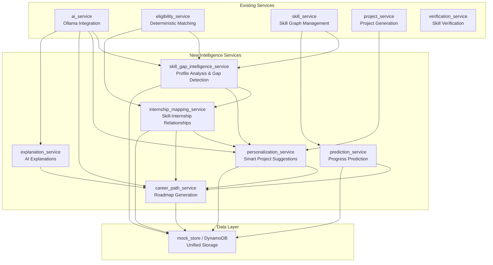
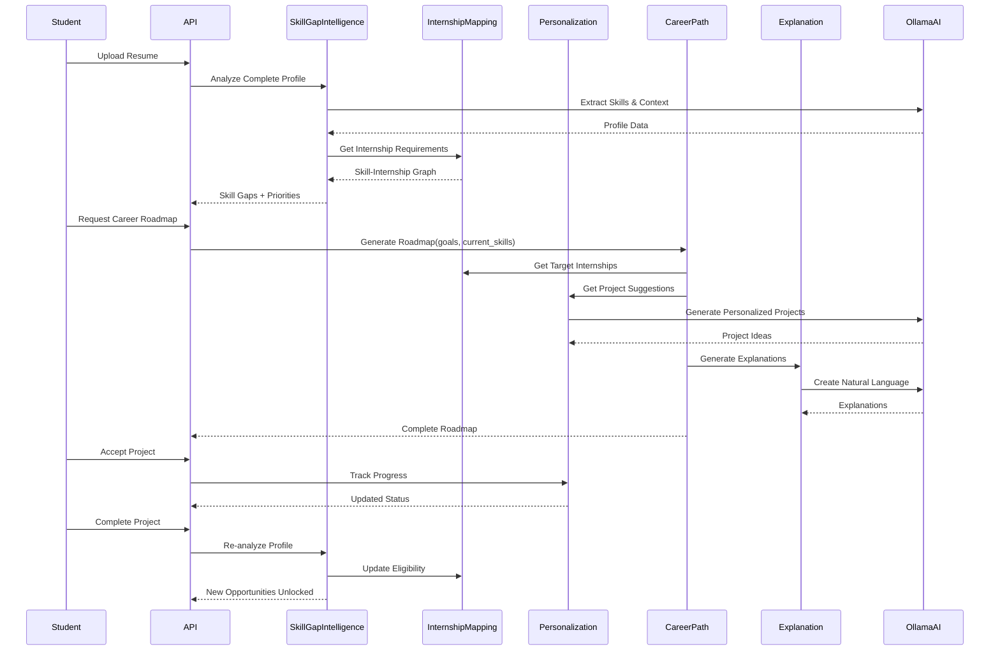

# Design Document: Career Intelligence System

## Overview

The Career Intelligence System extends Eligify's existing platform with AI-powered career guidance capabilities. It integrates seamlessly with the current Python FastAPI backend, Ollama AI service, and deterministic eligibility engine to provide personalized skill gap analysis, smart project recommendations, career path planning, and explainable AI insights. The system maintains the existing architecture patterns while adding six new intelligent services that work together to guide students from their current skill level to their target career goals.

The design preserves Eligify's core principle: deterministic eligibility matching remains unchanged, while AI enhances personalization, explanation, and prediction capabilities. All new features integrate with existing services (ai_service, eligibility_service, skill_service, project_service, verification_service) and follow established patterns for error handling, retry logic, and data storage.

## Architecture




## Main Workflow: Student Career Journey



## Components and Interfaces

### Component 1: Skill Gap Intelligence Service

**Purpose**: Analyze student's complete profile to identify skill gaps, prioritize learning paths, and track progress toward target roles.

**Interface**:
```python
from typing import List, Dict, Any, Optional
from pydantic import BaseModel, Field

class ProfileAnalysisRequest(BaseModel):
    """Request for comprehensive profile analysis"""
    user_id: str = Field(alias="userId")
    target_internship_ids: Optional[List[str]] = Field(None, alias="targetInternshipIds")
    target_roles: Optional[List[str]] = Field(None, alias="targetRoles")
    include_predictions: bool = Field(True, alias="includePredictions")

class SkillGapAnalysis(BaseModel):
    """Comprehensive skill gap analysis result"""
    user_id: str = Field(alias="userId")
    analysis_id: str = Field(alias="analysisId")
    current_profile: Dict[str, Any] = Field(alias="currentProfile")
    skill_gaps: List[Dict[str, Any]] = Field(alias="skillGaps")
    prioritized_skills: List[Dict[str, Any]] = Field(alias="prioritizedSkills")
    learning_path: List[str] = Field(alias="learningPath")
    estimated_timeline: str = Field(alias="estimatedTimeline")
    confidence_score: float = Field(alias="confidenceScore", ge=0, le=100)
    created_at: str = Field(alias="createdAt")

class SkillGapIntelligenceService:
    async def analyze_profile(
        self, 
        request: ProfileAnalysisRequest
    ) -> SkillGapAnalysis:
        """Analyze complete student profile and identify gaps"""
        pass
    
    async def get_skill_priorities(
        self, 
        user_id: str, 
        target_context: str
    ) -> List[Dict[str, Any]]:
        """Get prioritized list of skills to learn"""
        pass
    
    async def calculate_readiness_score(
        self, 
        user_id: str, 
        internship_id: str
    ) -> Dict[str, Any]:
        """Calculate career readiness for specific internship"""
        pass
```

**Responsibilities**:
- Aggregate data from skill_service, project_service, and resume parsing
- Use AI to understand skill relationships and dependencies
- Prioritize skill gaps based on impact on target internships
- Calculate learning effort estimates
- Track skill evolution over time


### Component 2: Internship Mapping Service

**Purpose**: Create and maintain relationship graphs between internships, skills, and projects to enable intelligent recommendations.

**Interface**:
```python
from typing import List, Dict, Any, Set
from pydantic import BaseModel, Field

class SkillInternshipMapping(BaseModel):
    """Mapping between skill and internships requiring it"""
    skill_name: str = Field(alias="skillName")
    normalized_name: str = Field(alias="normalizedName")
    internship_ids: List[str] = Field(alias="internshipIds")
    average_proficiency_required: int = Field(alias="averageProficiencyRequired")
    mandatory_count: int = Field(alias="mandatoryCount")
    total_count: int = Field(alias="totalCount")

class InternshipSkillGraph(BaseModel):
    """Complete graph of internship-skill relationships"""
    graph_id: str = Field(alias="graphId")
    skill_mappings: Dict[str, SkillInternshipMapping] = Field(alias="skillMappings")
    internship_clusters: List[Dict[str, Any]] = Field(alias="internshipClusters")
    skill_dependencies: Dict[str, List[str]] = Field(alias="skillDependencies")
    last_updated: str = Field(alias="lastUpdated")

class InternshipMappingService:
    async def build_skill_internship_graph(
        self, 
        internships: List[Dict[str, Any]]
    ) -> InternshipSkillGraph:
        """Build complete mapping of skills to internships"""
        pass
    
    async def get_internships_by_skill(
        self, 
        skill_name: str, 
        min_proficiency: int = 0
    ) -> List[str]:
        """Get internships requiring specific skill"""
        pass
    
    async def find_skill_clusters(
        self, 
        internship_ids: List[str]
    ) -> List[Set[str]]:
        """Find common skill patterns across internships"""
        pass
    
    async def get_skill_dependencies(
        self, 
        skill_name: str
    ) -> Dict[str, Any]:
        """Get prerequisite and related skills"""
        pass
    
    async def calculate_skill_impact(
        self, 
        skill_name: str, 
        user_id: str
    ) -> Dict[str, Any]:
        """Calculate how learning a skill impacts eligibility"""
        pass
```

**Responsibilities**:
- Build and maintain skill-internship relationship graph
- Identify skill clusters and patterns
- Calculate skill impact on eligibility
- Track skill prerequisites and dependencies
- Enable reverse lookup (skill → internships)

### Component 3: Personalization Service

**Purpose**: Generate smart, personalized project suggestions that adapt to student's skill level, learning velocity, and career goals.

**Interface**:
```python
from typing import List, Dict, Any, Optional
from pydantic import BaseModel, Field

class PersonalizationContext(BaseModel):
    """Context for personalized recommendations"""
    user_id: str = Field(alias="userId")
    current_skills: List[Dict[str, Any]] = Field(alias="currentSkills")
    completed_projects: List[str] = Field(alias="completedProjects")
    learning_velocity: float = Field(alias="learningVelocity")
    time_availability: str = Field(alias="timeAvailability")
    career_goals: List[str] = Field(alias="careerGoals")
    preferences: Dict[str, Any] = {}

class PersonalizedProjectSuggestion(BaseModel):
    """Personalized project suggestion with reasoning"""
    project: Dict[str, Any]
    relevance_score: float = Field(alias="relevanceScore", ge=0, le=100)
    skills_addressed: List[str] = Field(alias="skillsAddressed")
    skill_gap_closure: float = Field(alias="skillGapClosure", ge=0, le=100)
    internships_unlocked: List[str] = Field(alias="internshipsUnlocked")
    estimated_completion_time: str = Field(alias="estimatedCompletionTime")
    difficulty_match: str = Field(alias="difficultyMatch")
    reasoning: str

class PersonalizationService:
    async def suggest_projects(
        self, 
        context: PersonalizationContext, 
        limit: int = 5
    ) -> List[PersonalizedProjectSuggestion]:
        """Generate personalized project suggestions"""
        pass
    
    async def rank_projects(
        self, 
        user_id: str, 
        projects: List[Dict[str, Any]]
    ) -> List[PersonalizedProjectSuggestion]:
        """Rank existing projects by relevance"""
        pass
    
    async def adapt_project_difficulty(
        self, 
        project: Dict[str, Any], 
        user_level: str
    ) -> Dict[str, Any]:
        """Adapt project difficulty to user level"""
        pass
    
    async def calculate_learning_velocity(
        self, 
        user_id: str
    ) -> float:
        """Calculate user's learning velocity from history"""
        pass
```

**Responsibilities**:
- Generate personalized project suggestions using AI
- Rank projects by relevance to user's goals
- Adapt project difficulty to user's skill level
- Calculate and track learning velocity
- Optimize for skill gap closure and internship eligibility


### Component 4: Career Path Service

**Purpose**: Generate comprehensive career roadmaps showing progressive steps from current position to long-term goals.

**Interface**:
```python
from typing import List, Dict, Any, Optional
from pydantic import BaseModel, Field

class CareerGoal(BaseModel):
    """Career goal definition"""
    goal_id: str = Field(alias="goalId")
    title: str
    target_role: str = Field(alias="targetRole")
    target_companies: Optional[List[str]] = Field(None, alias="targetCompanies")
    timeline: str
    priority: int = Field(ge=1, le=5)

class RoadmapMilestone(BaseModel):
    """Milestone in career roadmap"""
    milestone_id: str = Field(alias="milestoneId")
    title: str
    description: str
    skills_to_acquire: List[str] = Field(alias="skillsToAcquire")
    suggested_projects: List[str] = Field(alias="suggestedProjects")
    target_internships: List[str] = Field(alias="targetInternships")
    estimated_duration: str = Field(alias="estimatedDuration")
    order: int
    dependencies: List[str] = []

class CareerRoadmap(BaseModel):
    """Complete career roadmap"""
    roadmap_id: str = Field(alias="roadmapId")
    user_id: str = Field(alias="userId")
    goal: CareerGoal
    current_position: Dict[str, Any] = Field(alias="currentPosition")
    milestones: List[RoadmapMilestone]
    total_estimated_duration: str = Field(alias="totalEstimatedDuration")
    confidence_score: float = Field(alias="confidenceScore", ge=0, le=100)
    created_at: str = Field(alias="createdAt")
    updated_at: str = Field(alias="updatedAt")

class CareerPathService:
    async def generate_roadmap(
        self, 
        user_id: str, 
        goal: CareerGoal
    ) -> CareerRoadmap:
        """Generate complete career roadmap"""
        pass
    
    async def update_roadmap_progress(
        self, 
        roadmap_id: str, 
        completed_milestone_id: str
    ) -> CareerRoadmap:
        """Update roadmap based on completed milestone"""
        pass
    
    async def suggest_next_steps(
        self, 
        user_id: str, 
        roadmap_id: str
    ) -> List[Dict[str, Any]]:
        """Suggest immediate next steps"""
        pass
    
    async def estimate_timeline(
        self, 
        user_id: str, 
        target_role: str
    ) -> Dict[str, Any]:
        """Estimate timeline to reach target role"""
        pass
```

**Responsibilities**:
- Generate progressive career roadmaps using AI
- Break down long-term goals into achievable milestones
- Suggest projects and internships for each milestone
- Track roadmap progress and adapt to changes
- Provide timeline estimates based on learning velocity

### Component 5: Explanation Service

**Purpose**: Generate clear, natural language explanations for all AI recommendations and decisions.

**Interface**:
```python
from typing import List, Dict, Any, Optional
from pydantic import BaseModel, Field
from enum import Enum

class ExplanationType(str, Enum):
    """Type of explanation"""
    INTERNSHIP_MATCH = "internship_match"
    PROJECT_SUGGESTION = "project_suggestion"
    SKILL_PRIORITY = "skill_priority"
    CAREER_STEP = "career_step"
    ELIGIBILITY_CHANGE = "eligibility_change"

class Explanation(BaseModel):
    """AI-generated explanation"""
    explanation_id: str = Field(alias="explanationId")
    type: ExplanationType
    context: Dict[str, Any]
    explanation_text: str = Field(alias="explanationText")
    key_factors: List[str] = Field(alias="keyFactors")
    confidence: float = Field(ge=0, le=100)
    created_at: str = Field(alias="createdAt")

class ExplanationService:
    async def explain_internship_match(
        self, 
        user_id: str, 
        internship_id: str, 
        match_score: float
    ) -> Explanation:
        """Explain why internship matches or doesn't match"""
        pass
    
    async def explain_project_suggestion(
        self, 
        user_id: str, 
        project: Dict[str, Any], 
        reasoning: Dict[str, Any]
    ) -> Explanation:
        """Explain why project was suggested"""
        pass
    
    async def explain_skill_priority(
        self, 
        user_id: str, 
        skill_name: str, 
        priority_score: float
    ) -> Explanation:
        """Explain why skill is prioritized"""
        pass
    
    async def explain_career_step(
        self, 
        user_id: str, 
        milestone: Dict[str, Any]
    ) -> Explanation:
        """Explain career roadmap step"""
        pass
    
    async def generate_batch_explanations(
        self, 
        requests: List[Dict[str, Any]]
    ) -> List[Explanation]:
        """Generate multiple explanations efficiently"""
        pass
```

**Responsibilities**:
- Generate natural language explanations using AI
- Reference user's current skills and goals
- Explain reasoning behind recommendations
- Provide actionable insights
- Maintain consistent, student-friendly tone


### Component 6: Prediction Service

**Purpose**: Predict skill progress, learning timelines, and career readiness based on historical data and learning patterns.

**Interface**:
```python
from typing import List, Dict, Any, Optional
from pydantic import BaseModel, Field
from datetime import datetime

class SkillProgressPrediction(BaseModel):
    """Prediction of skill progress over time"""
    skill_name: str = Field(alias="skillName")
    current_proficiency: int = Field(alias="currentProficiency")
    predicted_proficiency: int = Field(alias="predictedProficiency")
    prediction_date: str = Field(alias="predictionDate")
    confidence: float = Field(ge=0, le=100)
    factors: List[str]

class CareerReadinessPrediction(BaseModel):
    """Prediction of career readiness"""
    user_id: str = Field(alias="userId")
    target_role: str = Field(alias="targetRole")
    current_readiness: float = Field(alias="currentReadiness", ge=0, le=100)
    predicted_readiness_date: str = Field(alias="predictedReadinessDate")
    required_actions: List[Dict[str, Any]] = Field(alias="requiredActions")
    confidence: float = Field(ge=0, le=100)

class PredictionService:
    async def predict_skill_progress(
        self, 
        user_id: str, 
        skill_name: str, 
        weeks_ahead: int = 4
    ) -> SkillProgressPrediction:
        """Predict skill proficiency growth"""
        pass
    
    async def predict_career_readiness(
        self, 
        user_id: str, 
        target_role: str
    ) -> CareerReadinessPrediction:
        """Predict when user will be ready for target role"""
        pass
    
    async def estimate_project_completion(
        self, 
        user_id: str, 
        project_id: str
    ) -> Dict[str, Any]:
        """Estimate project completion timeline"""
        pass
    
    async def calculate_learning_trajectory(
        self, 
        user_id: str
    ) -> Dict[str, Any]:
        """Calculate overall learning trajectory"""
        pass
```

**Responsibilities**:
- Predict skill proficiency evolution
- Estimate learning timelines
- Calculate career readiness scores
- Track learning velocity trends
- Provide confidence intervals for predictions

## Data Models

### Model 1: SkillGapAnalysis

```python
from typing import List, Dict, Any, Optional
from pydantic import BaseModel, Field
from datetime import datetime

class CurrentProfile(BaseModel):
    """Student's current profile snapshot"""
    total_skills: int = Field(alias="totalSkills")
    verified_skills: int = Field(alias="verifiedSkills")
    in_progress_skills: int = Field(alias="inProgressSkills")
    completed_projects: int = Field(alias="completedProjects")
    average_proficiency: float = Field(alias="averageProficiency")
    skill_categories: Dict[str, int] = Field(alias="skillCategories")

class SkillGap(BaseModel):
    """Individual skill gap"""
    skill_name: str = Field(alias="skillName")
    normalized_name: str = Field(alias="normalizedName")
    category: str
    current_proficiency: int = Field(alias="currentProficiency", ge=0, le=100)
    target_proficiency: int = Field(alias="targetProficiency", ge=0, le=100)
    gap_size: int = Field(alias="gapSize")
    priority_score: float = Field(alias="priorityScore", ge=0, le=100)
    impact_on_eligibility: int = Field(alias="impactOnEligibility")
    estimated_learning_hours: int = Field(alias="estimatedLearningHours")
    prerequisites: List[str] = []
    related_skills: List[str] = Field(alias="relatedSkills")

class PrioritizedSkill(BaseModel):
    """Skill with priority ranking"""
    skill_name: str = Field(alias="skillName")
    priority_rank: int = Field(alias="priorityRank")
    priority_score: float = Field(alias="priorityScore")
    reasoning: str
    internships_unlocked: int = Field(alias="internshipsUnlocked")
    suggested_projects: List[str] = Field(alias="suggestedProjects")

class SkillGapAnalysis(BaseModel):
    """Complete skill gap analysis"""
    user_id: str = Field(alias="userId")
    analysis_id: str = Field(alias="analysisId")
    current_profile: CurrentProfile = Field(alias="currentProfile")
    skill_gaps: List[SkillGap] = Field(alias="skillGaps")
    prioritized_skills: List[PrioritizedSkill] = Field(alias="prioritizedSkills")
    learning_path: List[str] = Field(alias="learningPath")
    estimated_timeline: str = Field(alias="estimatedTimeline")
    confidence_score: float = Field(alias="confidenceScore", ge=0, le=100)
    target_internships: Optional[List[str]] = Field(None, alias="targetInternships")
    target_roles: Optional[List[str]] = Field(None, alias="targetRoles")
    created_at: str = Field(alias="createdAt")
    expires_at: str = Field(alias="expiresAt")
```

**Validation Rules**:
- gap_size must equal target_proficiency - current_proficiency
- priority_score must be between 0 and 100
- estimated_learning_hours must be positive
- learning_path must be ordered by prerequisites
- confidence_score decreases with prediction distance


### Model 2: InternshipSkillGraph

```python
from typing import List, Dict, Any, Set
from pydantic import BaseModel, Field

class SkillInternshipMapping(BaseModel):
    """Mapping between skill and internships"""
    skill_name: str = Field(alias="skillName")
    normalized_name: str = Field(alias="normalizedName")
    category: str
    internship_ids: List[str] = Field(alias="internshipIds")
    average_proficiency_required: int = Field(alias="averageProficiencyRequired", ge=0, le=100)
    min_proficiency_required: int = Field(alias="minProficiencyRequired", ge=0, le=100)
    max_proficiency_required: int = Field(alias="maxProficiencyRequired", ge=0, le=100)
    mandatory_count: int = Field(alias="mandatoryCount")
    total_count: int = Field(alias="totalCount")
    weight_sum: float = Field(alias="weightSum")

class InternshipCluster(BaseModel):
    """Cluster of related internships"""
    cluster_id: str = Field(alias="clusterId")
    cluster_name: str = Field(alias="clusterName")
    internship_ids: List[str] = Field(alias="internshipIds")
    common_skills: List[str] = Field(alias="commonSkills")
    skill_overlap_score: float = Field(alias="skillOverlapScore")

class SkillDependency(BaseModel):
    """Skill dependency relationship"""
    skill_name: str = Field(alias="skillName")
    prerequisites: List[str]
    related_skills: List[str] = Field(alias="relatedSkills")
    dependent_skills: List[str] = Field(alias="dependentSkills")
    learning_order: int = Field(alias="learningOrder")

class InternshipSkillGraph(BaseModel):
    """Complete graph of internship-skill relationships"""
    graph_id: str = Field(alias="graphId")
    skill_mappings: Dict[str, SkillInternshipMapping] = Field(alias="skillMappings")
    internship_clusters: List[InternshipCluster] = Field(alias="internshipClusters")
    skill_dependencies: Dict[str, SkillDependency] = Field(alias="skillDependencies")
    total_internships: int = Field(alias="totalInternships")
    total_unique_skills: int = Field(alias="totalUniqueSkills")
    last_updated: str = Field(alias="lastUpdated")
```

**Validation Rules**:
- internship_ids must reference valid internships
- average_proficiency must be between min and max
- mandatory_count must be <= total_count
- skill_dependencies must not have circular references
- cluster skill_overlap_score must be between 0 and 100

### Model 3: CareerRoadmap

```python
from typing import List, Dict, Any, Optional
from pydantic import BaseModel, Field

class CareerGoal(BaseModel):
    """Career goal definition"""
    goal_id: str = Field(alias="goalId")
    title: str
    target_role: str = Field(alias="targetRole")
    target_companies: Optional[List[str]] = Field(None, alias="targetCompanies")
    target_salary_range: Optional[Dict[str, int]] = Field(None, alias="targetSalaryRange")
    timeline: str
    priority: int = Field(ge=1, le=5)

class RoadmapMilestone(BaseModel):
    """Milestone in career roadmap"""
    milestone_id: str = Field(alias="milestoneId")
    title: str
    description: str
    skills_to_acquire: List[str] = Field(alias="skillsToAcquire")
    target_proficiency_levels: Dict[str, int] = Field(alias="targetProficiencyLevels")
    suggested_projects: List[str] = Field(alias="suggestedProjects")
    target_internships: List[str] = Field(alias="targetInternships")
    learning_resources: List[Dict[str, str]] = Field(alias="learningResources")
    estimated_duration: str = Field(alias="estimatedDuration")
    estimated_hours: int = Field(alias="estimatedHours")
    order: int
    dependencies: List[str] = []
    status: str = "not_started"  # not_started, in_progress, completed
    completed_at: Optional[str] = Field(None, alias="completedAt")

class CurrentPosition(BaseModel):
    """Student's current position"""
    total_skills: int = Field(alias="totalSkills")
    verified_skills: int = Field(alias="verifiedSkills")
    completed_projects: int = Field(alias="completedProjects")
    eligible_internships: int = Field(alias="eligibleInternships")
    readiness_score: float = Field(alias="readinessScore", ge=0, le=100)

class CareerRoadmap(BaseModel):
    """Complete career roadmap"""
    roadmap_id: str = Field(alias="roadmapId")
    user_id: str = Field(alias="userId")
    goal: CareerGoal
    current_position: CurrentPosition = Field(alias="currentPosition")
    milestones: List[RoadmapMilestone]
    total_estimated_duration: str = Field(alias="totalEstimatedDuration")
    total_estimated_hours: int = Field(alias="totalEstimatedHours")
    progress_percentage: float = Field(alias="progressPercentage", ge=0, le=100)
    confidence_score: float = Field(alias="confidenceScore", ge=0, le=100)
    next_recommended_action: Dict[str, Any] = Field(alias="nextRecommendedAction")
    created_at: str = Field(alias="createdAt")
    updated_at: str = Field(alias="updatedAt")
    last_progress_update: Optional[str] = Field(None, alias="lastProgressUpdate")
```

**Validation Rules**:
- milestones must be ordered sequentially
- dependencies must reference valid milestone_ids
- progress_percentage calculated from completed milestones
- total_estimated_hours sum of milestone hours
- confidence_score decreases with timeline length


### Model 4: PersonalizationContext

```python
from typing import List, Dict, Any, Optional
from pydantic import BaseModel, Field

class LearningVelocityMetrics(BaseModel):
    """Metrics for learning velocity calculation"""
    projects_completed: int = Field(alias="projectsCompleted")
    average_completion_time_days: float = Field(alias="averageCompletionTimeDays")
    skills_verified_per_month: float = Field(alias="skillsVerifiedPerMonth")
    consistency_score: float = Field(alias="consistencyScore", ge=0, le=100)
    acceleration_trend: str  # "increasing", "stable", "decreasing"

class PersonalizationContext(BaseModel):
    """Context for personalized recommendations"""
    user_id: str = Field(alias="userId")
    current_skills: List[Dict[str, Any]] = Field(alias="currentSkills")
    skill_gaps: List[Dict[str, Any]] = Field(alias="skillGaps")
    completed_projects: List[str] = Field(alias="completedProjects")
    in_progress_projects: List[str] = Field(alias="inProgressProjects")
    learning_velocity: LearningVelocityMetrics = Field(alias="learningVelocity")
    time_availability: str = Field(alias="timeAvailability")  # "full_time", "part_time", "limited"
    career_goals: List[str] = Field(alias="careerGoals")
    target_internships: List[str] = Field(alias="targetInternships")
    preferences: Dict[str, Any] = {}
    learning_style: Optional[str] = Field(None, alias="learningStyle")  # "hands_on", "theoretical", "mixed"

class PersonalizedProjectSuggestion(BaseModel):
    """Personalized project suggestion with reasoning"""
    project: Dict[str, Any]
    relevance_score: float = Field(alias="relevanceScore", ge=0, le=100)
    skills_addressed: List[str] = Field(alias="skillsAddressed")
    skill_gap_closure: float = Field(alias="skillGapClosure", ge=0, le=100)
    internships_unlocked: List[str] = Field(alias="internshipsUnlocked")
    estimated_completion_time: str = Field(alias="estimatedCompletionTime")
    estimated_hours: int = Field(alias="estimatedHours")
    difficulty_match: str = Field(alias="difficultyMatch")  # "perfect", "slightly_easy", "slightly_hard"
    reasoning: str
    key_benefits: List[str] = Field(alias="keyBenefits")
    prerequisites_met: bool = Field(alias="prerequisitesMet")
```

**Validation Rules**:
- learning_velocity metrics must be non-negative
- time_availability must be valid enum value
- relevance_score calculated from multiple factors
- skill_gap_closure percentage of gaps addressed
- estimated_hours must match project complexity

### Model 5: Explanation

```python
from typing import List, Dict, Any, Optional
from pydantic import BaseModel, Field
from enum import Enum

class ExplanationType(str, Enum):
    """Type of explanation"""
    INTERNSHIP_MATCH = "internship_match"
    PROJECT_SUGGESTION = "project_suggestion"
    SKILL_PRIORITY = "skill_priority"
    CAREER_STEP = "career_step"
    ELIGIBILITY_CHANGE = "eligibility_change"
    LEARNING_PATH = "learning_path"

class ExplanationFactor(BaseModel):
    """Individual factor in explanation"""
    factor_name: str = Field(alias="factorName")
    impact: str  # "positive", "negative", "neutral"
    weight: float = Field(ge=0, le=1)
    description: str

class Explanation(BaseModel):
    """AI-generated explanation"""
    explanation_id: str = Field(alias="explanationId")
    type: ExplanationType
    context: Dict[str, Any]
    explanation_text: str = Field(alias="explanationText")
    key_factors: List[ExplanationFactor] = Field(alias="keyFactors")
    confidence: float = Field(ge=0, le=100)
    actionable_insights: List[str] = Field(alias="actionableInsights")
    references: Dict[str, Any] = {}
    created_at: str = Field(alias="createdAt")
```

**Validation Rules**:
- explanation_text must be clear and student-friendly
- key_factors weights must sum to approximately 1.0
- confidence based on data quality and AI certainty
- actionable_insights must be specific and achievable

## Algorithmic Pseudocode

### Main Processing Algorithm: Skill Gap Analysis

```python
def analyze_profile(user_id: str, target_internship_ids: List[str]) -> SkillGapAnalysis:
    """
    Analyze student profile and identify skill gaps
    
    Preconditions:
    - user_id exists in system
    - user has at least one skill in skill graph
    - target_internship_ids reference valid internships
    
    Postconditions:
    - Returns complete SkillGapAnalysis
    - skill_gaps ordered by priority_score descending
    - learning_path respects skill dependencies
    - All gaps have valid estimated_learning_hours
    
    Loop Invariants:
    - All processed skills have valid proficiency levels (0-100)
    - Gap calculations remain consistent throughout iteration
    """
    # Step 1: Gather current profile data
    skill_graph = await skill_service.get_skill_graph(user_id)
    completed_projects = await project_service.get_user_projects(user_id, status="completed")
    
    current_profile = CurrentProfile(
        total_skills=skill_graph.total_skills,
        verified_skills=skill_graph.verified_skills,
        in_progress_skills=skill_graph.in_progress_skills,
        completed_projects=len(completed_projects),
        average_proficiency=calculate_average_proficiency(skill_graph.skills),
        skill_categories=categorize_skills(skill_graph.skills)
    )
    
    # Step 2: Get target internship requirements
    target_internships = []
    all_required_skills = {}
    
    for internship_id in target_internship_ids:
        internship = await get_internship(internship_id)
        target_internships.append(internship)
        
        # Aggregate required skills across all targets
        for req_skill in internship.required_skills:
            skill_key = normalize_skill_name(req_skill.name)
            if skill_key not in all_required_skills:
                all_required_skills[skill_key] = {
                    "name": req_skill.name,
                    "max_proficiency": req_skill.proficiency_level,
                    "mandatory_count": 1 if req_skill.mandatory else 0,
                    "total_count": 1,
                    "weight_sum": req_skill.weight
                }
            else:
                # Update with highest proficiency requirement
                all_required_skills[skill_key]["max_proficiency"] = max(
                    all_required_skills[skill_key]["max_proficiency"],
                    req_skill.proficiency_level
                )
                all_required_skills[skill_key]["mandatory_count"] += (1 if req_skill.mandatory else 0)
                all_required_skills[skill_key]["total_count"] += 1
                all_required_skills[skill_key]["weight_sum"] += req_skill.weight
    
    # Step 3: Calculate skill gaps
    skill_gaps = []
    user_skill_map = {normalize_skill_name(s.name): s for s in skill_graph.skills}
    
    for skill_key, req_data in all_required_skills.items():
        user_skill = user_skill_map.get(skill_key)
        current_prof = user_skill.proficiency_level if user_skill else 0
        target_prof = req_data["max_proficiency"]
        
        if current_prof < target_prof:
            gap_size = target_prof - current_prof
            
            # Calculate priority score (0-100)
            priority_score = calculate_priority_score(
                gap_size=gap_size,
                mandatory_count=req_data["mandatory_count"],
                total_count=req_data["total_count"],
                weight_sum=req_data["weight_sum"]
            )
            
            # Estimate learning hours
            estimated_hours = estimate_learning_hours(
                gap_size=gap_size,
                skill_category=get_skill_category(req_data["name"]),
                user_learning_velocity=await calculate_learning_velocity(user_id)
            )
            
            # Get skill dependencies
            dependencies = await internship_mapping_service.get_skill_dependencies(req_data["name"])
            
            skill_gap = SkillGap(
                skill_name=req_data["name"],
                normalized_name=skill_key,
                category=get_skill_category(req_data["name"]),
                current_proficiency=current_prof,
                target_proficiency=target_prof,
                gap_size=gap_size,
                priority_score=priority_score,
                impact_on_eligibility=req_data["total_count"],
                estimated_learning_hours=estimated_hours,
                prerequisites=dependencies.get("prerequisites", []),
                related_skills=dependencies.get("related_skills", [])
            )
            skill_gaps.append(skill_gap)
    
    # Step 4: Sort gaps by priority
    skill_gaps.sort(key=lambda x: x.priority_score, reverse=True)
    
    # Step 5: Create prioritized learning path
    prioritized_skills = []
    learning_path = []
    
    # Use topological sort to respect dependencies
    learning_path = topological_sort_skills(skill_gaps)
    
    # Create prioritized skill list with reasoning
    for rank, skill_gap in enumerate(skill_gaps[:10], 1):
        # Calculate internships unlocked by learning this skill
        internships_unlocked = await calculate_internships_unlocked(
            user_id, skill_gap.skill_name, skill_gap.target_proficiency
        )
        
        # Get suggested projects for this skill
        suggested_projects = await get_projects_for_skill(skill_gap.skill_name)
        
        # Generate reasoning using AI
        reasoning = await explanation_service.explain_skill_priority(
            user_id, skill_gap.skill_name, skill_gap.priority_score
        )
        
        prioritized_skill = PrioritizedSkill(
            skill_name=skill_gap.skill_name,
            priority_rank=rank,
            priority_score=skill_gap.priority_score,
            reasoning=reasoning.explanation_text,
            internships_unlocked=len(internships_unlocked),
            suggested_projects=[p["projectId"] for p in suggested_projects[:3]]
        )
        prioritized_skills.append(prioritized_skill)
    
    # Step 6: Estimate timeline
    total_hours = sum(gap.estimated_learning_hours for gap in skill_gaps)
    estimated_timeline = estimate_timeline_from_hours(total_hours, user_id)
    
    # Step 7: Calculate confidence score
    confidence_score = calculate_confidence_score(
        data_quality=len(completed_projects),
        prediction_distance=total_hours,
        skill_count=len(skill_gaps)
    )
    
    # Step 8: Create and return analysis
    analysis = SkillGapAnalysis(
        user_id=user_id,
        analysis_id=generate_uuid(),
        current_profile=current_profile,
        skill_gaps=skill_gaps,
        prioritized_skills=prioritized_skills,
        learning_path=learning_path,
        estimated_timeline=estimated_timeline,
        confidence_score=confidence_score,
        target_internships=target_internship_ids,
        created_at=datetime.utcnow().isoformat(),
        expires_at=(datetime.utcnow() + timedelta(days=7)).isoformat()
    )
    
    # Save to store
    await mock_store.save_skill_gap_analysis(analysis.dict(by_alias=True))
    
    return analysis
```


### Helper Algorithm: Priority Score Calculation

```python
def calculate_priority_score(
    gap_size: int,
    mandatory_count: int,
    total_count: int,
    weight_sum: float
) -> float:
    """
    Calculate priority score for skill gap
    
    Preconditions:
    - gap_size >= 0 and gap_size <= 100
    - mandatory_count >= 0
    - total_count >= mandatory_count
    - weight_sum > 0
    
    Postconditions:
    - Returns score between 0 and 100
    - Higher score means higher priority
    - Mandatory skills get higher scores
    
    Algorithm:
    Priority = (0.4 * gap_urgency) + (0.3 * mandatory_factor) + (0.3 * impact_factor)
    """
    # Gap urgency: larger gaps are more urgent (0-100)
    gap_urgency = min(gap_size * 1.2, 100)
    
    # Mandatory factor: mandatory skills get higher priority (0-100)
    mandatory_ratio = mandatory_count / total_count if total_count > 0 else 0
    mandatory_factor = mandatory_ratio * 100
    
    # Impact factor: skills required by more internships (0-100)
    # Normalize by assuming max 10 internships require same skill
    impact_factor = min((total_count / 10) * 100, 100)
    
    # Weighted combination
    priority_score = (0.4 * gap_urgency) + (0.3 * mandatory_factor) + (0.3 * impact_factor)
    
    return round(priority_score, 2)
```

### Algorithm: Personalized Project Suggestion

```python
async def suggest_projects(
    context: PersonalizationContext,
    limit: int = 5
) -> List[PersonalizedProjectSuggestion]:
    """
    Generate personalized project suggestions
    
    Preconditions:
    - context.user_id exists in system
    - context.skill_gaps is non-empty
    - limit > 0
    
    Postconditions:
    - Returns at most 'limit' suggestions
    - Suggestions ordered by relevance_score descending
    - All suggestions have prerequisites_met = True
    - Each suggestion addresses at least one skill gap
    
    Loop Invariants:
    - All generated projects are unique
    - Relevance scores remain between 0 and 100
    """
    suggestions = []
    
    # Step 1: Identify top priority skills to address
    priority_skills = [gap["skillName"] for gap in context.skill_gaps[:5]]
    
    # Step 2: For each priority skill, generate project ideas
    for skill_name in priority_skills:
        # Determine appropriate difficulty level
        user_skill = next(
            (s for s in context.current_skills if normalize_skill_name(s["name"]) == normalize_skill_name(skill_name)),
            None
        )
        current_proficiency = user_skill["proficiencyLevel"] if user_skill else 0
        
        # Map proficiency to difficulty
        if current_proficiency < 30:
            difficulty = "beginner"
        elif current_proficiency < 70:
            difficulty = "intermediate"
        else:
            difficulty = "advanced"
        
        # Generate project using AI
        project = await ai_service.generate_project(
            target_skills=[skill_name],
            student_level=difficulty,
            user_context={
                "completed_projects": context.completed_projects,
                "career_goals": context.career_goals,
                "time_availability": context.time_availability
            }
        )
        
        if not project:
            continue
        
        # Step 3: Calculate relevance metrics
        skills_addressed = [skill_name]
        
        # Check if project addresses multiple gaps
        for gap in context.skill_gaps:
            if gap["skillName"] in project.get("skillsToLearn", []):
                if gap["skillName"] not in skills_addressed:
                    skills_addressed.append(gap["skillName"])
        
        # Calculate skill gap closure percentage
        total_gap_size = sum(gap["gapSize"] for gap in context.skill_gaps)
        addressed_gap_size = sum(
            gap["gapSize"] for gap in context.skill_gaps 
            if gap["skillName"] in skills_addressed
        )
        skill_gap_closure = (addressed_gap_size / total_gap_size * 100) if total_gap_size > 0 else 0
        
        # Step 4: Calculate internships unlocked
        internships_unlocked = []
        for internship_id in context.target_internships:
            # Simulate skill graph with project completion
            simulated_skills = context.current_skills.copy()
            for skill in skills_addressed:
                # Assume project brings skill to 70% proficiency
                simulated_skills.append({
                    "name": skill,
                    "proficiencyLevel": 70,
                    "verified": True
                })
            
            # Check if now eligible
            match_result = await eligibility_service.calculate_match_score(
                simulated_skills, internship_id
            )
            if match_result["matchScore"] >= 80:
                internships_unlocked.append(internship_id)
        
        # Step 5: Calculate relevance score
        relevance_score = calculate_relevance_score(
            skill_gap_closure=skill_gap_closure,
            internships_unlocked=len(internships_unlocked),
            difficulty_match=difficulty,
            user_proficiency=current_proficiency,
            learning_velocity=context.learning_velocity.consistency_score
        )
        
        # Step 6: Estimate completion time
        base_hours = project.get("estimatedHours", 40)
        adjusted_hours = adjust_hours_for_velocity(
            base_hours,
            context.learning_velocity.average_completion_time_days
        )
        estimated_completion = format_duration(adjusted_hours, context.time_availability)
        
        # Step 7: Generate reasoning using AI
        reasoning_prompt = f"""Explain why this project is recommended for the student:

Student Context:
- Current skills: {', '.join([s['name'] for s in context.current_skills[:5]])}
- Skill gaps: {', '.join(priority_skills[:3])}
- Career goals: {', '.join(context.career_goals)}

Project:
- Title: {project['title']}
- Skills addressed: {', '.join(skills_addressed)}
- Difficulty: {difficulty}

Generate a 2-3 sentence explanation in natural, encouraging language."""

        reasoning_text = await ai_service.call_ollama(reasoning_prompt, temperature=0.7)
        
        # Step 8: Create suggestion
        suggestion = PersonalizedProjectSuggestion(
            project=project,
            relevance_score=relevance_score,
            skills_addressed=skills_addressed,
            skill_gap_closure=skill_gap_closure,
            internships_unlocked=internships_unlocked,
            estimated_completion_time=estimated_completion,
            estimated_hours=adjusted_hours,
            difficulty_match=assess_difficulty_match(difficulty, current_proficiency),
            reasoning=reasoning_text,
            key_benefits=[
                f"Learn {len(skills_addressed)} key skills",
                f"Unlock {len(internships_unlocked)} internship opportunities",
                f"Close {skill_gap_closure:.0f}% of skill gaps"
            ],
            prerequisites_met=True
        )
        
        suggestions.append(suggestion)
    
    # Step 9: Sort by relevance and return top N
    suggestions.sort(key=lambda x: x.relevance_score, reverse=True)
    return suggestions[:limit]
```

### Algorithm: Career Roadmap Generation

```python
async def generate_roadmap(
    user_id: str,
    goal: CareerGoal
) -> CareerRoadmap:
    """
    Generate comprehensive career roadmap
    
    Preconditions:
    - user_id exists in system
    - goal.target_role is valid role name
    - goal.timeline is parseable duration
    
    Postconditions:
    - Returns complete CareerRoadmap
    - Milestones ordered sequentially
    - Dependencies form valid DAG (no cycles)
    - Total estimated hours matches sum of milestones
    
    Loop Invariants:
    - All milestones have valid dependencies
    - Skill progression is monotonic (skills build on each other)
    """
    # Step 1: Get current position
    skill_graph = await skill_service.get_skill_graph(user_id)
    completed_projects = await project_service.get_user_projects(user_id, status="completed")
    classification = await eligibility_service.classify_internships(user_id, all_internships)
    
    current_position = CurrentPosition(
        total_skills=skill_graph.total_skills,
        verified_skills=skill_graph.verified_skills,
        completed_projects=len(completed_projects),
        eligible_internships=len(classification["eligible"]),
        readiness_score=calculate_readiness_score(skill_graph, goal.target_role)
    )
    
    # Step 2: Use AI to generate roadmap structure
    roadmap_prompt = f"""Generate a career roadmap for a student:

Current Position:
- Skills: {skill_graph.total_skills} total, {skill_graph.verified_skills} verified
- Projects: {len(completed_projects)} completed
- Eligible internships: {len(classification['eligible'])}

Goal:
- Target role: {goal.target_role}
- Timeline: {goal.timeline}
- Priority: {goal.priority}/5

Generate a JSON roadmap with 3-5 progressive milestones. Each milestone should:
1. Build on previous milestones
2. Include specific skills to acquire
3. Suggest relevant projects
4. Target specific internships
5. Estimate duration

Return JSON:
{{
  "milestones": [
    {{
      "title": "Foundation Phase",
      "description": "Build core skills",
      "skills_to_acquire": ["Python", "Git", "SQL"],
      "target_proficiency_levels": {{"Python": 70, "Git": 60, "SQL": 65}},
      "estimated_duration": "4-6 weeks",
      "estimated_hours": 80
    }}
  ]
}}"""

    ai_response = await ai_service.call_ollama(roadmap_prompt, temperature=0.7)
    roadmap_data = json.loads(clean_json_response(ai_response))
    
    # Step 3: Enrich milestones with specific recommendations
    milestones = []
    
    for idx, milestone_data in enumerate(roadmap_data["milestones"], 1):
        # Get project suggestions for milestone skills
        suggested_projects = await personalization_service.suggest_projects(
            PersonalizationContext(
                user_id=user_id,
                current_skills=skill_graph.skills,
                skill_gaps=[
                    {"skillName": skill, "gapSize": 100 - skill_graph.get_proficiency(skill)}
                    for skill in milestone_data["skills_to_acquire"]
                ],
                completed_projects=[p["projectId"] for p in completed_projects],
                learning_velocity=await prediction_service.calculate_learning_velocity(user_id),
                time_availability="part_time",
                career_goals=[goal.target_role],
                target_internships=[]
            ),
            limit=3
        )
        
        # Find target internships for this milestone
        target_internships = await find_internships_for_skills(
            milestone_data["skills_to_acquire"],
            milestone_data["target_proficiency_levels"]
        )
        
        # Get learning resources
        learning_resources = await get_learning_resources(
            milestone_data["skills_to_acquire"]
        )
        
        # Determine dependencies (previous milestone)
        dependencies = [milestones[idx-2].milestone_id] if idx > 1 else []
        
        milestone = RoadmapMilestone(
            milestone_id=generate_uuid(),
            title=milestone_data["title"],
            description=milestone_data["description"],
            skills_to_acquire=milestone_data["skills_to_acquire"],
            target_proficiency_levels=milestone_data["target_proficiency_levels"],
            suggested_projects=[p.project["projectId"] for p in suggested_projects],
            target_internships=[i["internshipId"] for i in target_internships[:3]],
            learning_resources=learning_resources,
            estimated_duration=milestone_data["estimated_duration"],
            estimated_hours=milestone_data["estimated_hours"],
            order=idx,
            dependencies=dependencies,
            status="not_started"
        )
        
        milestones.append(milestone)
    
    # Step 4: Calculate totals
    total_hours = sum(m.estimated_hours for m in milestones)
    total_duration = estimate_timeline_from_hours(total_hours, user_id)
    
    # Step 5: Calculate confidence score
    confidence = calculate_roadmap_confidence(
        current_position=current_position,
        goal_difficulty=assess_goal_difficulty(goal.target_role),
        timeline_feasibility=assess_timeline_feasibility(total_hours, goal.timeline),
        data_quality=len(completed_projects)
    )
    
    # Step 6: Determine next action
    next_action = {
        "type": "start_milestone",
        "milestone_id": milestones[0].milestone_id,
        "action": f"Start with {milestones[0].title}",
        "first_step": f"Begin learning {milestones[0].skills_to_acquire[0]}"
    }
    
    # Step 7: Create roadmap
    roadmap = CareerRoadmap(
        roadmap_id=generate_uuid(),
        user_id=user_id,
        goal=goal,
        current_position=current_position,
        milestones=milestones,
        total_estimated_duration=total_duration,
        total_estimated_hours=total_hours,
        progress_percentage=0.0,
        confidence_score=confidence,
        next_recommended_action=next_action,
        created_at=datetime.utcnow().isoformat(),
        updated_at=datetime.utcnow().isoformat()
    )
    
    # Save to store
    await mock_store.save_career_roadmap(roadmap.dict(by_alias=True))
    
    return roadmap
```


## Key Functions with Formal Specifications

### Function 1: build_skill_internship_graph()

```python
async def build_skill_internship_graph(
    internships: List[Dict[str, Any]]
) -> InternshipSkillGraph:
    """Build complete mapping of skills to internships"""
    pass
```

**Preconditions:**
- internships is non-empty list
- Each internship has valid requiredSkills array
- Each skill has name, proficiencyLevel, mandatory, weight fields

**Postconditions:**
- Returns valid InternshipSkillGraph
- skill_mappings contains all unique skills from internships
- No circular dependencies in skill_dependencies
- total_internships equals len(internships)
- total_unique_skills equals len(skill_mappings)

**Loop Invariants:**
- All processed skills have valid normalized names
- Proficiency calculations remain within 0-100 range
- Mandatory counts never exceed total counts

### Function 2: calculate_learning_velocity()

```python
async def calculate_learning_velocity(user_id: str) -> LearningVelocityMetrics:
    """Calculate user's learning velocity from history"""
    pass
```

**Preconditions:**
- user_id exists in system
- User has at least one completed project or verified skill

**Postconditions:**
- Returns valid LearningVelocityMetrics
- All metrics are non-negative
- consistency_score between 0 and 100
- acceleration_trend is valid enum value

**Loop Invariants:**
- Time calculations remain monotonic
- Completion rates are non-negative

### Function 3: explain_internship_match()

```python
async def explain_internship_match(
    user_id: str,
    internship_id: str,
    match_score: float
) -> Explanation:
    """Explain why internship matches or doesn't match"""
    pass
```

**Preconditions:**
- user_id and internship_id exist in system
- match_score between 0 and 100
- User has skill graph initialized

**Postconditions:**
- Returns valid Explanation object
- explanation_text is non-empty and student-friendly
- key_factors weights sum to approximately 1.0
- confidence score between 0 and 100
- actionable_insights contains at least one item

**Loop Invariants:**
- Factor weights remain normalized
- Explanation remains consistent with match_score

### Function 4: predict_skill_progress()

```python
async def predict_skill_progress(
    user_id: str,
    skill_name: str,
    weeks_ahead: int = 4
) -> SkillProgressPrediction:
    """Predict skill proficiency growth"""
    pass
```

**Preconditions:**
- user_id exists in system
- skill_name is valid skill
- weeks_ahead > 0 and weeks_ahead <= 52
- User has learning history data

**Postconditions:**
- Returns valid SkillProgressPrediction
- predicted_proficiency >= current_proficiency
- predicted_proficiency <= 100
- confidence decreases with prediction distance
- prediction_date is weeks_ahead from now

**Loop Invariants:**
- Proficiency growth is monotonic
- Confidence calculations remain consistent

### Function 5: topological_sort_skills()

```python
def topological_sort_skills(skill_gaps: List[SkillGap]) -> List[str]:
    """
    Sort skills by dependencies using topological sort
    
    Preconditions:
    - skill_gaps is non-empty
    - Dependency graph has no cycles
    - All prerequisites reference valid skills
    
    Postconditions:
    - Returns ordered list of skill names
    - Prerequisites appear before dependent skills
    - All skills from skill_gaps are included
    - Order respects all dependency constraints
    """
    # Build adjacency list
    graph = {}
    in_degree = {}
    
    for gap in skill_gaps:
        skill = gap.skill_name
        graph[skill] = gap.prerequisites
        in_degree[skill] = 0
    
    # Calculate in-degrees
    for skill in graph:
        for prereq in graph[skill]:
            if prereq in in_degree:
                in_degree[prereq] += 1
    
    # Kahn's algorithm
    queue = [skill for skill in in_degree if in_degree[skill] == 0]
    result = []
    
    while queue:
        skill = queue.pop(0)
        result.append(skill)
        
        for dependent in graph:
            if skill in graph[dependent]:
                in_degree[dependent] -= 1
                if in_degree[dependent] == 0:
                    queue.append(dependent)
    
    return result
```

## Example Usage

### Example 1: Complete Career Intelligence Flow

```python
from src.services.skill_gap_intelligence_service import skill_gap_intelligence_service
from src.services.personalization_service import personalization_service
from src.services.career_path_service import career_path_service
from src.services.explanation_service import explanation_service

# Step 1: Analyze student profile
analysis_request = ProfileAnalysisRequest(
    userId="user_123",
    targetInternshipIds=["intern_1", "intern_2", "intern_3"],
    targetRoles=["Backend Developer", "Full Stack Developer"],
    includePredictions=True
)

skill_gap_analysis = await skill_gap_intelligence_service.analyze_profile(analysis_request)

print(f"Found {len(skill_gap_analysis.skill_gaps)} skill gaps")
print(f"Top priority: {skill_gap_analysis.prioritized_skills[0].skill_name}")
print(f"Estimated timeline: {skill_gap_analysis.estimated_timeline}")

# Step 2: Get personalized project suggestions
context = PersonalizationContext(
    userId="user_123",
    currentSkills=[s.dict() for s in skill_graph.skills],
    skillGaps=[g.dict() for g in skill_gap_analysis.skill_gaps],
    completedProjects=["proj_1", "proj_2"],
    inProgressProjects=[],
    learningVelocity=await prediction_service.calculate_learning_velocity("user_123"),
    timeAvailability="part_time",
    careerGoals=["Backend Developer"],
    targetInternships=["intern_1", "intern_2"]
)

suggestions = await personalization_service.suggest_projects(context, limit=3)

for suggestion in suggestions:
    print(f"\nProject: {suggestion.project['title']}")
    print(f"Relevance: {suggestion.relevance_score}%")
    print(f"Skills: {', '.join(suggestion.skills_addressed)}")
    print(f"Reasoning: {suggestion.reasoning}")

# Step 3: Generate career roadmap
goal = CareerGoal(
    goalId=str(uuid4()),
    title="Become Backend Developer",
    targetRole="Backend Developer",
    targetCompanies=["Google", "Microsoft", "Amazon"],
    timeline="6 months",
    priority=5
)

roadmap = await career_path_service.generate_roadmap("user_123", goal)

print(f"\nRoadmap: {roadmap.goal.title}")
print(f"Milestones: {len(roadmap.milestones)}")
print(f"Total duration: {roadmap.total_estimated_duration}")
print(f"Confidence: {roadmap.confidence_score}%")

for milestone in roadmap.milestones:
    print(f"\n{milestone.order}. {milestone.title}")
    print(f"   Skills: {', '.join(milestone.skills_to_acquire)}")
    print(f"   Duration: {milestone.estimated_duration}")
    print(f"   Projects: {len(milestone.suggested_projects)}")

# Step 4: Get explanations
explanation = await explanation_service.explain_internship_match(
    "user_123",
    "intern_1",
    skill_gap_analysis.skill_gaps[0].priority_score
)

print(f"\nExplanation: {explanation.explanation_text}")
print(f"Key factors:")
for factor in explanation.key_factors:
    print(f"  - {factor.factor_name}: {factor.description}")
```

### Example 2: Skill Gap Analysis and Project Recommendation

```python
# Analyze profile for specific internship
analysis = await skill_gap_intelligence_service.analyze_profile(
    ProfileAnalysisRequest(
        userId="user_456",
        targetInternshipIds=["backend_intern_google"],
        includePredictions=True
    )
)

# Get top 3 priority skills
top_skills = analysis.prioritized_skills[:3]

print("Top Priority Skills:")
for skill in top_skills:
    print(f"{skill.priority_rank}. {skill.skill_name}")
    print(f"   Score: {skill.priority_score}")
    print(f"   Unlocks: {skill.internships_unlocked} internships")
    print(f"   Reasoning: {skill.reasoning}")

# Get personalized projects for top skill
projects = await personalization_service.suggest_projects(
    PersonalizationContext(
        userId="user_456",
        currentSkills=current_skills,
        skillGaps=[{"skillName": top_skills[0].skill_name, "gapSize": 50}],
        completedProjects=[],
        learningVelocity=LearningVelocityMetrics(
            projectsCompleted=2,
            averageCompletionTimeDays=14.5,
            skillsVerifiedPerMonth=3.2,
            consistencyScore=75.0,
            accelerationTrend="stable"
        ),
        timeAvailability="part_time",
        careerGoals=["Backend Developer"],
        targetInternships=["backend_intern_google"]
    ),
    limit=1
)

best_project = projects[0]
print(f"\nRecommended Project: {best_project.project['title']}")
print(f"Completion time: {best_project.estimated_completion_time}")
print(f"Gap closure: {best_project.skill_gap_closure}%")
print(f"Internships unlocked: {len(best_project.internships_unlocked)}")
```

### Example 3: Career Roadmap with Progress Tracking

```python
# Generate roadmap
goal = CareerGoal(
    goalId=str(uuid4()),
    title="Full Stack Developer at FAANG",
    targetRole="Full Stack Developer",
    targetCompanies=["Facebook", "Amazon", "Apple", "Netflix", "Google"],
    timeline="12 months",
    priority=5
)

roadmap = await career_path_service.generate_roadmap("user_789", goal)

# Student completes first milestone
await career_path_service.update_roadmap_progress(
    roadmap.roadmap_id,
    roadmap.milestones[0].milestone_id
)

# Get next steps
next_steps = await career_path_service.suggest_next_steps(
    "user_789",
    roadmap.roadmap_id
)

print("Next Steps:")
for step in next_steps:
    print(f"- {step['action']}")
    print(f"  Estimated time: {step['estimated_time']}")
    print(f"  Impact: {step['impact_description']}")

# Predict when user will be ready
prediction = await prediction_service.predict_career_readiness(
    "user_789",
    "Full Stack Developer"
)

print(f"\nCareer Readiness Prediction:")
print(f"Current: {prediction.current_readiness}%")
print(f"Ready by: {prediction.predicted_readiness_date}")
print(f"Confidence: {prediction.confidence}%")
```


## Correctness Properties

### Universal Quantification Statements

**Property 1: Skill Gap Consistency**
```
∀ user_id, internship_id:
  skill_gap_analysis = analyze_profile(user_id, [internship_id])
  ⟹ ∀ gap ∈ skill_gap_analysis.skill_gaps:
      gap.gap_size = gap.target_proficiency - gap.current_proficiency
      ∧ 0 ≤ gap.current_proficiency ≤ 100
      ∧ 0 ≤ gap.target_proficiency ≤ 100
      ∧ gap.gap_size > 0
```

**Property 2: Priority Score Bounds**
```
∀ skill_gap ∈ SkillGapAnalysis.skill_gaps:
  0 ≤ skill_gap.priority_score ≤ 100
  ∧ (skill_gap.mandatory_count > 0 ⟹ skill_gap.priority_score ≥ 50)
```

**Property 3: Learning Path Dependency**
```
∀ roadmap ∈ CareerRoadmap:
  ∀ milestone ∈ roadmap.milestones:
    ∀ dep_id ∈ milestone.dependencies:
      ∃ dep_milestone ∈ roadmap.milestones:
        dep_milestone.milestone_id = dep_id
        ∧ dep_milestone.order < milestone.order
```

**Property 4: Skill-Internship Mapping Consistency**
```
∀ graph ∈ InternshipSkillGraph:
  ∀ skill_name, mapping ∈ graph.skill_mappings:
    mapping.mandatory_count ≤ mapping.total_count
    ∧ mapping.min_proficiency ≤ mapping.average_proficiency ≤ mapping.max_proficiency
    ∧ len(mapping.internship_ids) = mapping.total_count
```

**Property 5: Personalization Relevance**
```
∀ suggestion ∈ PersonalizedProjectSuggestion:
  0 ≤ suggestion.relevance_score ≤ 100
  ∧ len(suggestion.skills_addressed) > 0
  ∧ suggestion.prerequisites_met = true
  ∧ suggestion.estimated_hours > 0
```

**Property 6: Prediction Monotonicity**
```
∀ user_id, skill_name, weeks_ahead:
  prediction = predict_skill_progress(user_id, skill_name, weeks_ahead)
  ⟹ prediction.predicted_proficiency ≥ prediction.current_proficiency
     ∧ prediction.confidence ∈ [0, 100]
     ∧ (weeks_ahead > 12 ⟹ prediction.confidence < 70)
```

**Property 7: Explanation Completeness**
```
∀ explanation ∈ Explanation:
  len(explanation.explanation_text) > 0
  ∧ len(explanation.key_factors) > 0
  ∧ sum(factor.weight for factor in explanation.key_factors) ≈ 1.0
  ∧ len(explanation.actionable_insights) > 0
```

**Property 8: Roadmap Progress Consistency**
```
∀ roadmap ∈ CareerRoadmap:
  completed_milestones = count(m for m in roadmap.milestones if m.status = "completed")
  ⟹ roadmap.progress_percentage = (completed_milestones / len(roadmap.milestones)) * 100
     ∧ 0 ≤ roadmap.progress_percentage ≤ 100
```

**Property 9: Learning Velocity Non-Negativity**
```
∀ user_id:
  velocity = calculate_learning_velocity(user_id)
  ⟹ velocity.projects_completed ≥ 0
     ∧ velocity.average_completion_time_days ≥ 0
     ∧ velocity.skills_verified_per_month ≥ 0
     ∧ 0 ≤ velocity.consistency_score ≤ 100
```

**Property 10: Internship Unlocking Accuracy**
```
∀ user_id, project:
  suggestion = suggest_project(user_id, project)
  ⟹ ∀ internship_id ∈ suggestion.internships_unlocked:
      simulated_match = calculate_match_with_project(user_id, internship_id, project)
      ⟹ simulated_match.match_score ≥ 80
         ∧ simulated_match.missing_mandatory_skills = 0
```

## Error Handling

### Error Scenario 1: AI Service Unavailable

**Condition**: Ollama service is not running or unreachable
**Response**: 
- Catch ServiceUnavailableError from ai_service
- Return cached analysis if available (< 24 hours old)
- Fall back to rule-based recommendations
- Log error with retry timestamp
**Recovery**: 
- Retry with exponential backoff (3 attempts)
- Notify user with clear message: "AI recommendations temporarily unavailable"
- Provide basic skill gap analysis using deterministic methods

### Error Scenario 2: Invalid User Context

**Condition**: User has no skills, projects, or profile data
**Response**:
- Return empty SkillGapAnalysis with confidence_score = 0
- Suggest starting with resume upload or manual skill entry
- Provide generic beginner roadmap
**Recovery**:
- Guide user through profile completion
- Offer sample projects for beginners
- Re-analyze once minimum data available

### Error Scenario 3: Circular Skill Dependencies

**Condition**: Skill dependency graph contains cycles
**Response**:
- Detect cycle using DFS during topological sort
- Break cycle by removing lowest-weight edge
- Log warning with cycle details
- Continue with modified graph
**Recovery**:
- Use heuristic ordering (priority_score) as fallback
- Mark affected skills with warning flag
- Notify admin for manual review

### Error Scenario 4: AI Response Parsing Failure

**Condition**: AI returns malformed JSON or unexpected format
**Response**:
- Catch JSONDecodeError
- Attempt to clean response (remove markdown, extra text)
- Retry with simplified prompt (1 attempt)
- Fall back to template-based generation
**Recovery**:
- Use predefined project templates
- Generate explanation from template
- Log failure for prompt improvement

### Error Scenario 5: Prediction Data Insufficient

**Condition**: User has < 2 completed projects for velocity calculation
**Response**:
- Return prediction with low confidence (< 30%)
- Use platform average learning velocity
- Add disclaimer to prediction
**Recovery**:
- Collect more data over time
- Re-calculate predictions after each project completion
- Improve confidence as data accumulates

### Error Scenario 6: Roadmap Generation Timeout

**Condition**: AI takes > 30 seconds to generate roadmap
**Response**:
- Cancel AI request
- Generate simplified roadmap using templates
- Use skill gap analysis to populate milestones
**Recovery**:
- Offer to regenerate with more time
- Cache partial results for reuse
- Provide manual roadmap customization

## Testing Strategy

### Unit Testing Approach

Test each service independently with mocked dependencies:

**Skill Gap Intelligence Service**:
- Test priority score calculation with various gap sizes
- Verify topological sort handles dependencies correctly
- Test confidence score calculation edge cases
- Validate gap size calculations
- Test with empty/minimal user profiles

**Internship Mapping Service**:
- Test graph building with various internship sets
- Verify skill clustering algorithms
- Test dependency detection
- Validate impact calculations
- Test with overlapping skill requirements

**Personalization Service**:
- Test relevance score calculation
- Verify difficulty matching logic
- Test learning velocity calculations
- Validate project ranking
- Test with various user contexts

**Career Path Service**:
- Test milestone ordering and dependencies
- Verify timeline estimation
- Test progress tracking
- Validate confidence calculations
- Test roadmap updates

**Explanation Service**:
- Test explanation generation for each type
- Verify factor weight normalization
- Test with various match scores
- Validate actionable insights generation
- Test batch explanation efficiency

**Prediction Service**:
- Test skill progress predictions
- Verify readiness calculations
- Test timeline estimations
- Validate confidence intervals
- Test with limited historical data

**Coverage Goals**: 
- Line coverage: > 85%
- Branch coverage: > 80%
- Critical paths: 100%


### Property-Based Testing Approach

**Property Test Library**: Hypothesis (Python)

**Property Test 1: Priority Score Bounds**
```python
from hypothesis import given, strategies as st

@given(
    gap_size=st.integers(min_value=0, max_value=100),
    mandatory_count=st.integers(min_value=0, max_value=10),
    total_count=st.integers(min_value=1, max_value=10),
    weight_sum=st.floats(min_value=0.1, max_value=10.0)
)
def test_priority_score_bounds(gap_size, mandatory_count, total_count, weight_sum):
    """Priority score must always be between 0 and 100"""
    # Ensure mandatory_count <= total_count
    mandatory_count = min(mandatory_count, total_count)
    
    score = calculate_priority_score(gap_size, mandatory_count, total_count, weight_sum)
    
    assert 0 <= score <= 100
    assert isinstance(score, float)
```

**Property Test 2: Skill Gap Consistency**
```python
@given(
    current_prof=st.integers(min_value=0, max_value=100),
    target_prof=st.integers(min_value=0, max_value=100)
)
def test_skill_gap_consistency(current_prof, target_prof):
    """Gap size must equal target - current"""
    if target_prof > current_prof:
        gap = SkillGap(
            skill_name="TestSkill",
            normalized_name="testskill",
            category="programming_language",
            current_proficiency=current_prof,
            target_proficiency=target_prof,
            gap_size=target_prof - current_prof,
            priority_score=50.0,
            impact_on_eligibility=1,
            estimated_learning_hours=10,
            prerequisites=[],
            related_skills=[]
        )
        
        assert gap.gap_size == gap.target_proficiency - gap.current_proficiency
        assert gap.gap_size > 0
```

**Property Test 3: Topological Sort Validity**
```python
@given(
    skills=st.lists(
        st.tuples(
            st.text(min_size=1, max_size=20),
            st.lists(st.text(min_size=1, max_size=20), max_size=3)
        ),
        min_size=1,
        max_size=10,
        unique_by=lambda x: x[0]
    )
)
def test_topological_sort_validity(skills):
    """Topological sort must respect all dependencies"""
    # Build skill gaps with dependencies
    skill_gaps = []
    for skill_name, prereqs in skills:
        gap = SkillGap(
            skill_name=skill_name,
            normalized_name=skill_name.lower(),
            category="tool",
            current_proficiency=0,
            target_proficiency=70,
            gap_size=70,
            priority_score=50.0,
            impact_on_eligibility=1,
            estimated_learning_hours=10,
            prerequisites=prereqs,
            related_skills=[]
        )
        skill_gaps.append(gap)
    
    try:
        sorted_skills = topological_sort_skills(skill_gaps)
        
        # Verify all skills are included
        assert len(sorted_skills) == len(skill_gaps)
        
        # Verify dependencies appear before dependents
        skill_positions = {skill: idx for idx, skill in enumerate(sorted_skills)}
        for gap in skill_gaps:
            for prereq in gap.prerequisites:
                if prereq in skill_positions:
                    assert skill_positions[prereq] < skill_positions[gap.skill_name]
    except ValueError:
        # Circular dependency detected - acceptable
        pass
```

**Property Test 4: Learning Velocity Non-Negativity**
```python
@given(
    projects_completed=st.integers(min_value=0, max_value=100),
    completion_times=st.lists(st.floats(min_value=0.1, max_value=365.0), min_size=1, max_size=100)
)
def test_learning_velocity_non_negative(projects_completed, completion_times):
    """All learning velocity metrics must be non-negative"""
    velocity = LearningVelocityMetrics(
        projects_completed=projects_completed,
        average_completion_time_days=sum(completion_times) / len(completion_times),
        skills_verified_per_month=projects_completed / max(len(completion_times) / 30, 1),
        consistency_score=min(100, projects_completed * 10),
        acceleration_trend="stable"
    )
    
    assert velocity.projects_completed >= 0
    assert velocity.average_completion_time_days >= 0
    assert velocity.skills_verified_per_month >= 0
    assert 0 <= velocity.consistency_score <= 100
```

**Property Test 5: Relevance Score Calculation**
```python
@given(
    skill_gap_closure=st.floats(min_value=0, max_value=100),
    internships_unlocked=st.integers(min_value=0, max_value=20),
    consistency_score=st.floats(min_value=0, max_value=100)
)
def test_relevance_score_bounds(skill_gap_closure, internships_unlocked, consistency_score):
    """Relevance score must be between 0 and 100"""
    score = calculate_relevance_score(
        skill_gap_closure=skill_gap_closure,
        internships_unlocked=internships_unlocked,
        difficulty_match="intermediate",
        user_proficiency=50,
        learning_velocity=consistency_score
    )
    
    assert 0 <= score <= 100
    assert isinstance(score, float)
```

### Integration Testing Approach

Test service interactions and data flow:

**Integration Test 1: Complete Career Intelligence Flow**
- Upload resume → Extract skills → Analyze gaps → Suggest projects → Generate roadmap
- Verify data consistency across services
- Test with real Ollama AI service
- Validate end-to-end timing (< 60 seconds)

**Integration Test 2: Skill Gap to Project Suggestion**
- Create user with specific skill gaps
- Generate skill gap analysis
- Request personalized projects
- Verify projects address identified gaps
- Check internship unlocking predictions

**Integration Test 3: Roadmap Progress Tracking**
- Generate career roadmap
- Complete milestone (project completion)
- Update roadmap progress
- Verify milestone dependencies
- Check next action recommendations

**Integration Test 4: Explanation Generation**
- Perform eligibility classification
- Generate explanations for each match
- Verify explanations reference actual user data
- Check explanation consistency with scores

**Integration Test 5: Prediction Accuracy**
- Create user with historical data
- Generate predictions
- Simulate time passage and skill growth
- Compare predictions with actual outcomes
- Measure prediction accuracy

**Integration Test 6: Error Recovery**
- Simulate AI service failure
- Verify fallback mechanisms
- Test retry logic
- Validate cached data usage
- Check user-facing error messages

## Performance Considerations

**AI Call Optimization**:
- Batch multiple AI requests when possible
- Cache AI responses for 24 hours
- Use lower temperature (0.3) for deterministic tasks
- Implement request queuing for high load
- Set aggressive timeouts (30 seconds max)

**Database Query Optimization**:
- Index user_id, internship_id, skill_name fields
- Use batch queries for multiple internships
- Cache skill-internship graph (rebuild daily)
- Implement pagination for large result sets
- Use projection to fetch only needed fields

**Computation Optimization**:
- Cache priority score calculations
- Memoize topological sort results
- Pre-compute skill dependencies
- Use incremental updates for roadmap progress
- Implement lazy loading for explanations

**Memory Management**:
- Stream large AI responses
- Limit in-memory skill graphs to 1000 skills
- Use generators for large result sets
- Clear caches after 24 hours
- Implement connection pooling

**Target Performance Metrics**:
- Skill gap analysis: < 5 seconds
- Project suggestion: < 10 seconds
- Career roadmap generation: < 30 seconds
- Explanation generation: < 3 seconds
- Prediction calculation: < 2 seconds
- API response time (p95): < 15 seconds

## Security Considerations

**Data Privacy**:
- Encrypt user profile data at rest
- Sanitize AI prompts (remove PII)
- Implement data retention policies (90 days for analyses)
- Allow users to delete career data
- Audit log all AI interactions

**Access Control**:
- Verify user_id matches authenticated user
- Implement rate limiting (10 requests/minute per user)
- Validate all input parameters
- Prevent unauthorized roadmap access
- Check permissions for internship data

**AI Safety**:
- Validate AI responses before storage
- Sanitize AI-generated text (remove harmful content)
- Implement content filters for explanations
- Monitor AI response quality
- Fallback to templates for suspicious outputs

**Input Validation**:
- Validate all user_id, internship_id references
- Check proficiency levels (0-100 range)
- Validate timeline formats
- Sanitize skill names (prevent injection)
- Limit list sizes (max 100 items)

**Error Information Disclosure**:
- Never expose internal error details to users
- Log detailed errors server-side only
- Return generic error messages
- Sanitize stack traces
- Mask sensitive data in logs

## Dependencies

**Existing Eligify Services**:
- ai_service (Ollama integration)
- eligibility_service (deterministic matching)
- skill_service (skill graph management)
- project_service (project generation)
- verification_service (skill verification)

**Python Libraries**:
- pydantic (data validation)
- httpx (async HTTP client)
- python-dateutil (date parsing)
- networkx (graph algorithms) - NEW
- numpy (numerical computations) - NEW

**External Services**:
- Ollama (local LLM - Llama 3.1 8B)
- DynamoDB (future - currently mock_store)

**Infrastructure**:
- FastAPI (web framework)
- JWT (authentication)
- Mock store (development storage)

**Development Tools**:
- pytest (testing)
- hypothesis (property-based testing) - NEW
- pytest-asyncio (async testing)
- pytest-cov (coverage)

## API Endpoints

### New Endpoints to Add

**POST /api/v1/intelligence/analyze-profile**
- Analyze complete user profile and identify skill gaps
- Request: ProfileAnalysisRequest
- Response: SkillGapAnalysis
- Auth: Required

**GET /api/v1/intelligence/skill-priorities/{user_id}**
- Get prioritized list of skills to learn
- Query params: target_context (optional)
- Response: List[PrioritizedSkill]
- Auth: Required

**POST /api/v1/intelligence/suggest-projects**
- Get personalized project suggestions
- Request: PersonalizationContext
- Response: List[PersonalizedProjectSuggestion]
- Auth: Required

**POST /api/v1/intelligence/career-roadmap**
- Generate career roadmap
- Request: { userId, goal: CareerGoal }
- Response: CareerRoadmap
- Auth: Required

**PUT /api/v1/intelligence/career-roadmap/{roadmap_id}/progress**
- Update roadmap progress
- Request: { milestoneId, status }
- Response: CareerRoadmap
- Auth: Required

**GET /api/v1/intelligence/next-steps/{user_id}/{roadmap_id}**
- Get next recommended actions
- Response: List[Dict[str, Any]]
- Auth: Required

**POST /api/v1/intelligence/explain**
- Generate explanation for recommendation
- Request: { type, context }
- Response: Explanation
- Auth: Required

**GET /api/v1/intelligence/predict/skill-progress/{user_id}/{skill_name}**
- Predict skill progress
- Query params: weeks_ahead (default: 4)
- Response: SkillProgressPrediction
- Auth: Required

**GET /api/v1/intelligence/predict/career-readiness/{user_id}/{target_role}**
- Predict career readiness
- Response: CareerReadinessPrediction
- Auth: Required

**GET /api/v1/intelligence/internship-graph**
- Get skill-internship relationship graph
- Query params: refresh (boolean)
- Response: InternshipSkillGraph
- Auth: Required (admin)

## Implementation Notes

**Phase 1: Core Intelligence (Weeks 1-2)**
- Implement skill_gap_intelligence_service
- Implement internship_mapping_service
- Add basic API endpoints
- Write unit tests

**Phase 2: Personalization (Weeks 3-4)**
- Implement personalization_service
- Implement prediction_service
- Add learning velocity tracking
- Write integration tests

**Phase 3: Career Planning (Weeks 5-6)**
- Implement career_path_service
- Implement explanation_service
- Add roadmap management
- Write property-based tests

**Phase 4: Polish & Optimization (Week 7)**
- Performance optimization
- Error handling improvements
- Documentation
- End-to-end testing

**Migration Strategy**:
- All new services use mock_store initially
- DynamoDB migration happens separately
- Maintain backward compatibility
- Feature flags for gradual rollout
