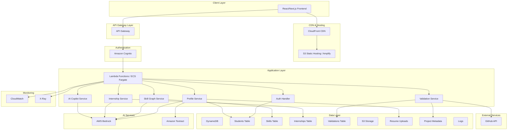
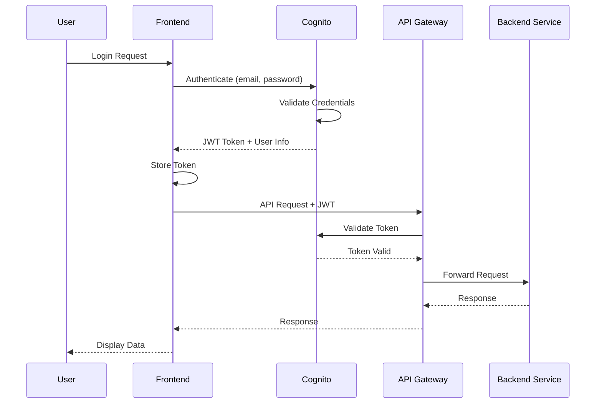
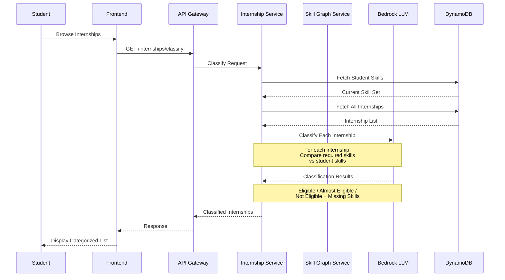
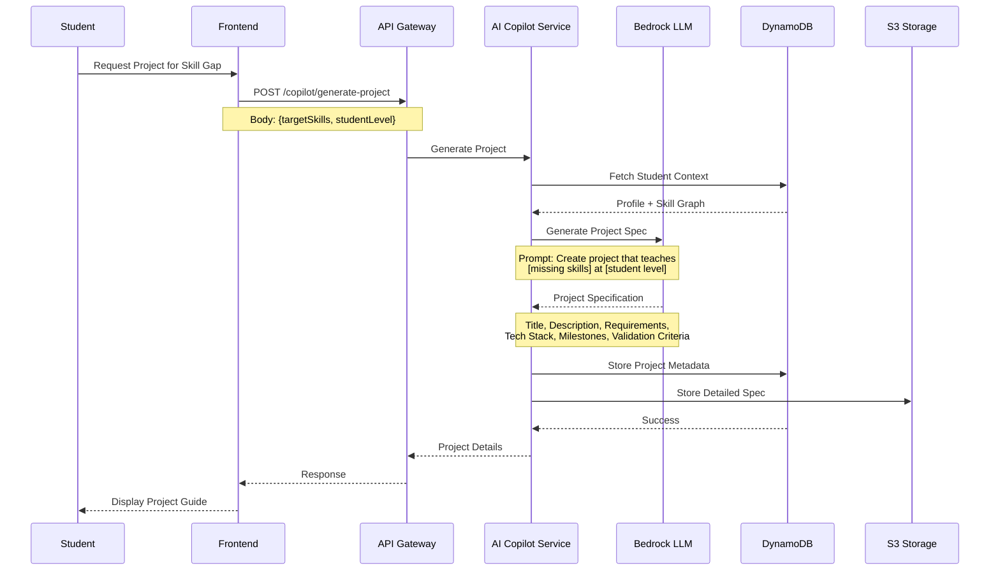
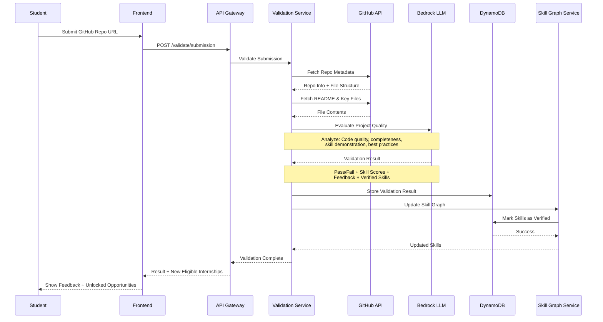

# Design Document: Eligify Platform

## Overview

Eligify is an AI-powered Employability Operating System designed to solve the fragmented employability journey faced by Indian students. Unlike traditional course platforms or job boards, Eligify creates a closed-loop system that connects skill gaps to guided skill building, verified competency, and opportunity eligibility. The platform analyzes student profiles, builds structured skill graphs, classifies internships based on eligibility, generates AI-powered project recommendations to fill skill gaps, validates competency through GitHub submissions, and unlocks new opportunities as skills are verified. The system is built entirely on AWS infrastructure using managed services for scalability, reliability, and hackathon-friendly deployment.

## Architecture

The Eligify platform follows a modern serverless-first architecture leveraging AWS managed services. The system consists of three primary layers: the presentation layer (React/Next.js frontend hosted on AWS Amplify or S3+CloudFront), the application layer (Python FastAPI backend on Lambda+API Gateway or ECS Fargate), and the data layer (DynamoDB for skill graphs and student data, S3 for file storage). AI capabilities are powered by AWS Bedrock for LLM operations and Amazon Textract for document parsing. Authentication is handled by Amazon Cognito with role-based access control. The architecture supports both synchronous API requests and asynchronous background processing for computationally intensive operations like GitHub validation and AI-powered skill analysis.



## Main Request Flows

### User Authentication Flow




### Student Onboarding & Profile Analysis Flow

```mermaid
sequenceDiagram
    participant S as Student
    participant FE as Frontend
    participant API as API Gateway
    participant PS as Profile Service
    participant TX as Textract
    participant AI as Bedrock LLM
    participant DB as DynamoDB
    participant S3 as S3 Storage
    
    S->>FE: Upload Resume
    FE->>API: POST /profile/upload
    API->>PS: Process Upload
    PS->>S3: Store Resume
    S3-->>PS: S3 URI
    PS->>TX: Extract Text
    TX-->>PS: Parsed Text
    PS->>AI: Analyze Skills & Experience
    AI-->>PS: Structured Profile Data
    PS->>DB: Store Student Profile
    PS->>DB: Initialize Skill Graph
    DB-->>PS: Success
    PS-->>API: Profile Created
    API-->>FE: Profile Data
    FE-->>S: Show Dashboard
```



### Internship Classification Flow




### AI Project Generation Flow (SkillGenie)



### GitHub Validation Flow




## Components and Interfaces

### Component 1: Authentication Service

**Purpose**: Manages user authentication, authorization, and session management using Amazon Cognito

**Interface**:
```typescript
interface AuthService {
  signUp(email: string, password: string, role: UserRole): Promise<AuthResult>
  signIn(email: string, password: string): Promise<AuthResult>
  signOut(userId: string): Promise<void>
  refreshToken(refreshToken: string): Promise<TokenResult>
  validateToken(token: string): Promise<TokenValidation>
  getUserInfo(userId: string): Promise<UserInfo>
}

interface AuthResult {
  success: boolean
  userId?: string
  accessToken?: string
  refreshToken?: string
  idToken?: string
  error?: string
}

interface TokenValidation {
  valid: boolean
  userId?: string
  role?: UserRole
  expiresAt?: number
}

enum UserRole {
  STUDENT = "student",
  ADMIN = "admin"
}
```

**Responsibilities**:
- User registration with email verification
- Login/logout operations
- JWT token generation and validation
- Role-based access control enforcement
- Integration with Cognito User Pools

### Component 2: Profile Service

**Purpose**: Handles student profile creation, resume parsing, and profile management

**Interface**:
```typescript
interface ProfileService {
  uploadResume(userId: string, file: File): Promise<UploadResult>
  parseResume(s3Uri: string): Promise<ParsedProfile>
  createProfile(userId: string, profileData: ProfileData): Promise<Profile>
  updateProfile(userId: string, updates: Partial<ProfileData>): Promise<Profile>
  getProfile(userId: string): Promise<Profile>
  deleteProfile(userId: string): Promise<void>
}

interface ParsedProfile {
  name: string
  email: string
  phone?: string
  education: Education[]
  experience: Experience[]
  skills: string[]
  projects: Project[]
  certifications: Certification[]
}

interface Profile {
  userId: string
  personalInfo: PersonalInfo
  education: Education[]
  experience: Experience[]
  skills: SkillNode[]
  projects: Project[]
  certifications: Certification[]
  createdAt: string
  updatedAt: string
}
```

**Responsibilities**:
- Resume upload to S3
- Resume parsing using Textract or LLM
- Structured profile data extraction
- Profile CRUD operations
- Initial skill graph creation


### Component 3: Skill Graph Service

**Purpose**: Manages the student's skill graph, tracking skill acquisition, verification status, and proficiency levels

**Interface**:
```typescript
interface SkillGraphService {
  initializeSkillGraph(userId: string, initialSkills: string[]): Promise<SkillGraph>
  getSkillGraph(userId: string): Promise<SkillGraph>
  addSkill(userId: string, skill: SkillNode): Promise<SkillGraph>
  updateSkillStatus(userId: string, skillId: string, status: SkillStatus): Promise<SkillNode>
  verifySkill(userId: string, skillId: string, validationId: string): Promise<SkillNode>
  getSkillGaps(userId: string, requiredSkills: string[]): Promise<SkillGap[]>
  calculateProficiency(userId: string, skillId: string): Promise<number>
}

interface SkillGraph {
  userId: string
  skills: SkillNode[]
  lastUpdated: string
}

interface SkillNode {
  skillId: string
  name: string
  category: SkillCategory
  status: SkillStatus
  proficiencyLevel: number // 0-100
  verifiedAt?: string
  validationId?: string
  source: SkillSource
  relatedSkills: string[]
}

enum SkillStatus {
  CLAIMED = "claimed",
  IN_PROGRESS = "in_progress",
  VERIFIED = "verified"
}

enum SkillCategory {
  PROGRAMMING_LANGUAGE = "programming_language",
  FRAMEWORK = "framework",
  TOOL = "tool",
  SOFT_SKILL = "soft_skill",
  DOMAIN_KNOWLEDGE = "domain_knowledge"
}

enum SkillSource {
  RESUME = "resume",
  PROJECT = "project",
  VALIDATION = "validation",
  MANUAL = "manual"
}

interface SkillGap {
  skillName: string
  required: boolean
  currentProficiency: number
  targetProficiency: number
  priority: "high" | "medium" | "low"
}
```

**Responsibilities**:
- Maintain student skill inventory
- Track skill verification status
- Calculate skill proficiency scores
- Identify skill gaps for internship requirements
- Update skills based on project validations


### Component 4: Internship Service

**Purpose**: Manages internship listings and classifies them based on student eligibility

**Interface**:
```typescript
interface InternshipService {
  createInternship(internship: InternshipData): Promise<Internship>
  getInternship(internshipId: string): Promise<Internship>
  listInternships(filters?: InternshipFilters): Promise<Internship[]>
  classifyInternships(userId: string): Promise<ClassifiedInternships>
  updateInternship(internshipId: string, updates: Partial<InternshipData>): Promise<Internship>
  deleteInternship(internshipId: string): Promise<void>
}

interface Internship {
  internshipId: string
  title: string
  company: string
  description: string
  requiredSkills: RequiredSkill[]
  preferredSkills: string[]
  duration: string
  stipend?: string
  location: string
  type: "remote" | "onsite" | "hybrid"
  applicationDeadline: string
  startDate: string
  createdAt: string
  updatedAt: string
}

interface RequiredSkill {
  name: string
  proficiencyLevel: number // 0-100
  mandatory: boolean
}

interface ClassifiedInternships {
  eligible: InternshipMatch[]
  almostEligible: InternshipMatch[]
  notEligible: InternshipMatch[]
}

interface InternshipMatch {
  internship: Internship
  matchScore: number // 0-100
  missingSkills: SkillGap[]
  matchedSkills: string[]
  recommendation?: string
}
```

**Responsibilities**:
- Store and manage internship listings
- Classify internships into eligibility categories
- Calculate match scores between student skills and requirements
- Identify missing skills for "Almost Eligible" internships
- Generate recommendations for skill building


### Component 5: AI Copilot Service (SkillGenie)

**Purpose**: Generates personalized project specifications to help students build missing skills

**Interface**:
```typescript
interface AICopilotService {
  generateProject(request: ProjectGenerationRequest): Promise<GeneratedProject>
  refineProject(projectId: string, feedback: string): Promise<GeneratedProject>
  getProjectSuggestions(userId: string, targetInternshipId?: string): Promise<ProjectSuggestion[]>
  chatWithCopilot(userId: string, message: string, context?: ChatContext): Promise<ChatResponse>
}

interface ProjectGenerationRequest {
  userId: string
  targetSkills: string[]
  studentLevel: "beginner" | "intermediate" | "advanced"
  timeCommitment?: string
  preferences?: ProjectPreferences
}

interface GeneratedProject {
  projectId: string
  title: string
  description: string
  objectives: string[]
  targetSkills: string[]
  techStack: string[]
  milestones: Milestone[]
  estimatedDuration: string
  difficulty: "beginner" | "intermediate" | "advanced"
  validationCriteria: ValidationCriterion[]
  resources: Resource[]
  createdAt: string
}

interface Milestone {
  title: string
  description: string
  tasks: string[]
  estimatedHours: number
}

interface ValidationCriterion {
  criterion: string
  weight: number
  checkType: "automated" | "manual" | "ai"
}

interface ProjectSuggestion {
  project: GeneratedProject
  relevanceScore: number
  skillsAddressed: string[]
  internshipsUnlocked: string[]
}

interface ChatResponse {
  message: string
  suggestions?: string[]
  projectRecommendations?: ProjectSuggestion[]
}
```

**Responsibilities**:
- Generate personalized project specifications
- Tailor projects to student skill level
- Create structured learning paths
- Provide conversational guidance
- Suggest projects based on career goals


### Component 6: Validation Service

**Purpose**: Validates student project submissions via GitHub and updates skill verification status

**Interface**:
```typescript
interface ValidationService {
  submitProject(submission: ProjectSubmission): Promise<ValidationResult>
  getValidationStatus(validationId: string): Promise<ValidationStatus>
  revalidateProject(validationId: string): Promise<ValidationResult>
  getValidationHistory(userId: string): Promise<ValidationResult[]>
}

interface ProjectSubmission {
  userId: string
  projectId: string
  githubRepoUrl: string
  description?: string
  additionalNotes?: string
}

interface ValidationResult {
  validationId: string
  userId: string
  projectId: string
  status: "pending" | "passed" | "failed" | "needs_revision"
  overallScore: number // 0-100
  skillScores: SkillScore[]
  verifiedSkills: string[]
  feedback: ValidationFeedback
  validatedAt: string
}

interface SkillScore {
  skillName: string
  score: number // 0-100
  verified: boolean
  evidence: string[]
}

interface ValidationFeedback {
  strengths: string[]
  improvements: string[]
  codeQuality: number // 0-100
  completeness: number // 0-100
  bestPractices: number // 0-100
  documentation: number // 0-100
  detailedComments: string
}

interface ValidationStatus {
  validationId: string
  status: "pending" | "processing" | "completed" | "failed"
  progress: number // 0-100
  estimatedCompletion?: string
}
```

**Responsibilities**:
- Accept GitHub repository submissions
- Fetch repository contents via GitHub API
- Analyze code quality and completeness
- Evaluate skill demonstration
- Generate detailed feedback
- Update skill graph with verified skills
- Trigger internship re-classification


## Data Models

### Model 1: Student Profile

```typescript
interface StudentProfile {
  // Primary Key
  userId: string // Cognito User ID
  
  // Personal Information
  personalInfo: {
    name: string
    email: string
    phone?: string
    location?: string
    linkedinUrl?: string
    githubUsername?: string
    portfolioUrl?: string
  }
  
  // Education
  education: {
    institution: string
    degree: string
    field: string
    startDate: string
    endDate?: string
    cgpa?: number
    current: boolean
  }[]
  
  // Experience
  experience: {
    company: string
    role: string
    description: string
    startDate: string
    endDate?: string
    current: boolean
    skills: string[]
  }[]
  
  // Projects
  projects: {
    projectId: string
    title: string
    description: string
    githubUrl?: string
    liveUrl?: string
    skills: string[]
    validated: boolean
  }[]
  
  // Certifications
  certifications: {
    name: string
    issuer: string
    issueDate: string
    expiryDate?: string
    credentialUrl?: string
  }[]
  
  // Resume
  resumeS3Uri?: string
  resumeUploadedAt?: string
  
  // Metadata
  role: UserRole
  onboardingComplete: boolean
  createdAt: string
  updatedAt: string
  lastLoginAt?: string
}
```

**Validation Rules**:
- userId must be unique and match Cognito User ID
- email must be valid email format
- At least one education entry required for onboarding
- CGPA must be between 0 and 10 (if provided)
- GitHub username must be valid GitHub handle format
- Phone must match Indian phone number format (+91 or 10 digits)


### Model 2: Skill Graph

```typescript
interface SkillGraphModel {
  // Primary Key
  userId: string
  
  // Skills Collection
  skills: {
    skillId: string // UUID
    name: string
    normalizedName: string // lowercase, no spaces
    category: SkillCategory
    status: SkillStatus
    proficiencyLevel: number // 0-100
    
    // Verification
    verified: boolean
    verifiedAt?: string
    validationId?: string
    
    // Source tracking
    source: SkillSource
    sourceDetails?: string
    
    // Relationships
    relatedSkills: string[] // skillIds
    prerequisites: string[] // skillIds
    
    // Metadata
    addedAt: string
    lastUpdatedAt: string
  }[]
  
  // Graph Metadata
  totalSkills: number
  verifiedSkills: number
  inProgressSkills: number
  lastUpdated: string
}
```

**Validation Rules**:
- userId must reference existing student profile
- skillId must be unique within user's skill graph
- proficiencyLevel must be between 0 and 100
- verified can only be true if validationId is provided
- normalizedName must be lowercase alphanumeric with underscores
- relatedSkills and prerequisites must reference valid skillIds

### Model 3: Internship

```typescript
interface InternshipModel {
  // Primary Key
  internshipId: string // UUID
  
  // Basic Information
  title: string
  company: string
  description: string
  
  // Requirements
  requiredSkills: {
    name: string
    proficiencyLevel: number // 0-100
    mandatory: boolean
    weight: number // importance weight
  }[]
  
  preferredSkills: string[]
  
  // Details
  duration: string // e.g., "3 months", "6 months"
  stipend?: {
    amount: number
    currency: string
    period: "monthly" | "total"
  }
  
  location: string
  type: "remote" | "onsite" | "hybrid"
  
  // Dates
  applicationDeadline: string
  startDate: string
  endDate?: string
  
  // Eligibility
  eligibilityCriteria: {
    minCGPA?: number
    graduationYear?: number[]
    degrees?: string[]
    institutions?: string[]
  }
  
  // Application
  applicationUrl?: string
  applicationProcess?: string
  
  // Metadata
  status: "active" | "closed" | "draft"
  postedBy: string // admin userId
  createdAt: string
  updatedAt: string
  viewCount: number
  applicationCount: number
}
```

**Validation Rules**:
- internshipId must be unique
- title and company are required
- At least one required skill must be present
- proficiencyLevel must be between 0 and 100
- applicationDeadline must be future date
- startDate must be after applicationDeadline
- stipend amount must be positive if provided
- status must be one of allowed values


### Model 4: Generated Project

```typescript
interface GeneratedProjectModel {
  // Primary Key
  projectId: string // UUID
  
  // Ownership
  userId: string
  generatedFor: "skill_gap" | "exploration" | "internship_prep"
  targetInternshipId?: string
  
  // Project Details
  title: string
  description: string
  objectives: string[]
  
  // Skills
  targetSkills: string[]
  skillsToLearn: string[]
  skillsToReinforce: string[]
  
  // Technical Specification
  techStack: {
    category: "frontend" | "backend" | "database" | "devops" | "other"
    technology: string
    version?: string
    purpose: string
  }[]
  
  // Structure
  milestones: {
    milestoneId: string
    title: string
    description: string
    tasks: string[]
    estimatedHours: number
    order: number
  }[]
  
  // Validation
  validationCriteria: {
    criterionId: string
    criterion: string
    weight: number // 0-100
    checkType: "automated" | "manual" | "ai"
    checkDetails?: string
  }[]
  
  // Resources
  resources: {
    type: "documentation" | "tutorial" | "video" | "article" | "tool"
    title: string
    url: string
    description?: string
  }[]
  
  // Metadata
  difficulty: "beginner" | "intermediate" | "advanced"
  estimatedDuration: string
  status: "suggested" | "accepted" | "in_progress" | "submitted" | "completed"
  
  // Submission
  submissionId?: string
  githubRepoUrl?: string
  submittedAt?: string
  
  // Timestamps
  createdAt: string
  updatedAt: string
  acceptedAt?: string
  completedAt?: string
}
```

**Validation Rules**:
- projectId must be unique
- userId must reference existing student
- At least one targetSkill required
- At least one milestone required
- Milestone order must be sequential starting from 1
- Validation criteria weights must sum to 100
- estimatedDuration must be valid duration string
- githubRepoUrl must be valid GitHub URL format if provided


### Model 5: Validation Result

```typescript
interface ValidationResultModel {
  // Primary Key
  validationId: string // UUID
  
  // References
  userId: string
  projectId: string
  submissionId: string
  
  // Submission Details
  githubRepoUrl: string
  githubRepoMetadata: {
    owner: string
    repoName: string
    stars: number
    forks: number
    lastCommit: string
    primaryLanguage: string
    languages: Record<string, number> // language: bytes
    fileCount: number
    hasReadme: boolean
    hasTests: boolean
  }
  
  // Validation Status
  status: "pending" | "processing" | "passed" | "failed" | "needs_revision"
  overallScore: number // 0-100
  
  // Skill Assessment
  skillScores: {
    skillName: string
    targetProficiency: number
    achievedProficiency: number
    score: number // 0-100
    verified: boolean
    evidence: string[] // specific files/commits demonstrating skill
  }[]
  
  // Quality Metrics
  qualityMetrics: {
    codeQuality: number // 0-100
    completeness: number // 0-100
    bestPractices: number // 0-100
    documentation: number // 0-100
    testing: number // 0-100
    gitUsage: number // 0-100
  }
  
  // Feedback
  feedback: {
    strengths: string[]
    improvements: string[]
    detailedComments: string
    nextSteps?: string[]
  }
  
  // Results
  verifiedSkills: string[] // skill names that passed verification
  skillsNeedingWork: string[]
  
  // AI Analysis
  aiAnalysis: {
    model: string // e.g., "claude-3-sonnet"
    prompt: string
    response: string
    confidence: number // 0-100
    analysisTimestamp: string
  }
  
  // Timestamps
  submittedAt: string
  validatedAt?: string
  processingStartedAt?: string
  processingCompletedAt?: string
}
```

**Validation Rules**:
- validationId must be unique
- userId and projectId must reference existing records
- githubRepoUrl must be valid and accessible
- overallScore must be between 0 and 100
- All quality metrics must be between 0 and 100
- status must transition in valid order: pending → processing → (passed|failed|needs_revision)
- verifiedSkills must be subset of project's targetSkills
- validatedAt must be after submittedAt


## Algorithmic Pseudocode

### Main Processing Algorithm: Internship Classification

```pascal
ALGORITHM classifyInternshipsForStudent(userId)
INPUT: userId of type String
OUTPUT: classifiedInternships of type ClassifiedInternships

BEGIN
  ASSERT userId IS NOT NULL AND userExists(userId)
  
  // Step 1: Fetch student's current skill graph
  studentSkills ← getSkillGraph(userId)
  ASSERT studentSkills IS NOT NULL
  
  // Step 2: Fetch all active internships
  internships ← getAllActiveInternships()
  
  // Initialize classification buckets
  eligible ← EMPTY_LIST
  almostEligible ← EMPTY_LIST
  notEligible ← EMPTY_LIST
  
  // Step 3: Classify each internship with loop invariant
  FOR each internship IN internships DO
    ASSERT allClassifiedInternshipsValid(eligible, almostEligible, notEligible)
    
    // Calculate match score
    matchResult ← calculateInternshipMatch(studentSkills, internship)
    
    // Classify based on match score and missing skills
    IF matchResult.matchScore >= 80 AND matchResult.missingMandatorySkills = 0 THEN
      eligible.add(matchResult)
    ELSE IF matchResult.matchScore >= 50 AND matchResult.missingMandatorySkills <= 2 THEN
      almostEligible.add(matchResult)
    ELSE
      notEligible.add(matchResult)
    END IF
  END FOR
  
  // Step 4: Sort each category by match score
  eligible ← sortByMatchScore(eligible, DESCENDING)
  almostEligible ← sortByMatchScore(almostEligible, DESCENDING)
  notEligible ← sortByMatchScore(notEligible, DESCENDING)
  
  ASSERT eligible.size + almostEligible.size + notEligible.size = internships.size
  
  RETURN {
    eligible: eligible,
    almostEligible: almostEligible,
    notEligible: notEligible
  }
END
```

**Preconditions:**
- userId is a valid non-null string
- User exists in the system with a complete profile
- User has at least one skill in their skill graph
- Database connection is available

**Postconditions:**
- Returns ClassifiedInternships object with three categories
- All active internships are classified into exactly one category
- Each category is sorted by match score in descending order
- Sum of all category sizes equals total active internships
- No internship appears in multiple categories

**Loop Invariants:**
- All previously classified internships are valid and properly categorized
- No internship has been classified into multiple categories
- Match scores are calculated consistently for all processed internships


### Algorithm: Calculate Internship Match Score

```pascal
ALGORITHM calculateInternshipMatch(studentSkills, internship)
INPUT: studentSkills of type SkillGraph, internship of type Internship
OUTPUT: matchResult of type InternshipMatch

BEGIN
  ASSERT studentSkills IS NOT NULL AND internship IS NOT NULL
  
  // Initialize tracking variables
  totalWeight ← 0
  achievedWeight ← 0
  matchedSkills ← EMPTY_LIST
  missingSkills ← EMPTY_LIST
  missingMandatoryCount ← 0
  
  // Step 1: Evaluate required skills
  FOR each requiredSkill IN internship.requiredSkills DO
    totalWeight ← totalWeight + requiredSkill.weight
    
    // Find matching skill in student's graph
    studentSkill ← findSkillByName(studentSkills, requiredSkill.name)
    
    IF studentSkill IS NOT NULL THEN
      // Calculate proficiency match
      proficiencyGap ← requiredSkill.proficiencyLevel - studentSkill.proficiencyLevel
      
      IF proficiencyGap <= 0 THEN
        // Student meets or exceeds requirement
        achievedWeight ← achievedWeight + requiredSkill.weight
        matchedSkills.add(requiredSkill.name)
      ELSE IF proficiencyGap <= 20 THEN
        // Close enough - partial credit
        partialCredit ← requiredSkill.weight * (1 - proficiencyGap / 100)
        achievedWeight ← achievedWeight + partialCredit
        matchedSkills.add(requiredSkill.name)
      ELSE
        // Significant gap
        missingSkills.add({
          skillName: requiredSkill.name,
          required: requiredSkill.mandatory,
          currentProficiency: studentSkill.proficiencyLevel,
          targetProficiency: requiredSkill.proficiencyLevel,
          priority: "high"
        })
        IF requiredSkill.mandatory THEN
          missingMandatoryCount ← missingMandatoryCount + 1
        END IF
      END IF
    ELSE
      // Skill not found in student's graph
      missingSkills.add({
        skillName: requiredSkill.name,
        required: requiredSkill.mandatory,
        currentProficiency: 0,
        targetProficiency: requiredSkill.proficiencyLevel,
        priority: requiredSkill.mandatory ? "high" : "medium"
      })
      IF requiredSkill.mandatory THEN
        missingMandatoryCount ← missingMandatoryCount + 1
      END IF
    END IF
  END FOR
  
  // Step 2: Calculate match score
  IF totalWeight > 0 THEN
    matchScore ← (achievedWeight / totalWeight) * 100
  ELSE
    matchScore ← 0
  END IF
  
  // Step 3: Generate AI recommendation
  recommendation ← generateRecommendation(matchScore, missingSkills, internship)
  
  ASSERT matchScore >= 0 AND matchScore <= 100
  ASSERT missingMandatoryCount >= 0
  
  RETURN {
    internship: internship,
    matchScore: matchScore,
    missingSkills: missingSkills,
    matchedSkills: matchedSkills,
    missingMandatorySkills: missingMandatoryCount,
    recommendation: recommendation
  }
END
```

**Preconditions:**
- studentSkills is a valid SkillGraph with at least one skill
- internship is a valid Internship with at least one required skill
- All skill weights are positive numbers
- All proficiency levels are between 0 and 100

**Postconditions:**
- matchScore is between 0 and 100
- All required skills are either in matchedSkills or missingSkills
- No skill appears in both matchedSkills and missingSkills
- missingMandatoryCount equals count of mandatory skills in missingSkills
- recommendation is a non-empty string

**Loop Invariants:**
- totalWeight is monotonically increasing
- achievedWeight never exceeds totalWeight
- All processed skills are categorized as matched or missing


### Algorithm: GitHub Project Validation

```pascal
ALGORITHM validateGitHubProject(submission)
INPUT: submission of type ProjectSubmission
OUTPUT: validationResult of type ValidationResult

BEGIN
  ASSERT submission IS NOT NULL
  ASSERT isValidGitHubUrl(submission.githubRepoUrl)
  
  // Step 1: Fetch repository data
  repoMetadata ← fetchGitHubRepoMetadata(submission.githubRepoUrl)
  ASSERT repoMetadata IS NOT NULL
  
  // Step 2: Fetch key files
  readmeContent ← fetchFileContent(submission.githubRepoUrl, "README.md")
  codeFiles ← fetchCodeFiles(submission.githubRepoUrl)
  
  // Step 3: Fetch project specification
  project ← getProject(submission.projectId)
  ASSERT project IS NOT NULL
  
  // Initialize validation state
  skillScores ← EMPTY_LIST
  qualityMetrics ← {
    codeQuality: 0,
    completeness: 0,
    bestPractices: 0,
    documentation: 0,
    testing: 0,
    gitUsage: 0
  }
  
  // Step 4: Evaluate each target skill
  FOR each targetSkill IN project.targetSkills DO
    // Use AI to analyze skill demonstration
    aiPrompt ← constructSkillEvaluationPrompt(
      targetSkill,
      codeFiles,
      readmeContent,
      project.validationCriteria
    )
    
    aiResponse ← invokeBedrockLLM(aiPrompt)
    
    skillScore ← parseSkillScore(aiResponse)
    skillScores.add(skillScore)
  END FOR
  
  // Step 5: Evaluate quality metrics
  qualityMetrics.codeQuality ← evaluateCodeQuality(codeFiles, repoMetadata)
  qualityMetrics.completeness ← evaluateCompleteness(project, codeFiles, repoMetadata)
  qualityMetrics.bestPractices ← evaluateBestPractices(codeFiles, repoMetadata)
  qualityMetrics.documentation ← evaluateDocumentation(readmeContent, codeFiles)
  qualityMetrics.testing ← evaluateTesting(repoMetadata, codeFiles)
  qualityMetrics.gitUsage ← evaluateGitUsage(repoMetadata)
  
  // Step 6: Calculate overall score
  overallScore ← calculateOverallScore(skillScores, qualityMetrics)
  
  // Step 7: Determine verification status
  verifiedSkills ← EMPTY_LIST
  FOR each skillScore IN skillScores DO
    IF skillScore.score >= 70 THEN
      verifiedSkills.add(skillScore.skillName)
    END IF
  END FOR
  
  // Step 8: Generate feedback
  feedback ← generateValidationFeedback(skillScores, qualityMetrics, project)
  
  // Step 9: Determine pass/fail status
  IF overallScore >= 70 AND verifiedSkills.size >= (project.targetSkills.size * 0.7) THEN
    status ← "passed"
  ELSE IF overallScore >= 50 THEN
    status ← "needs_revision"
  ELSE
    status ← "failed"
  END IF
  
  ASSERT overallScore >= 0 AND overallScore <= 100
  ASSERT status IN ["passed", "failed", "needs_revision"]
  
  RETURN {
    validationId: generateUUID(),
    userId: submission.userId,
    projectId: submission.projectId,
    status: status,
    overallScore: overallScore,
    skillScores: skillScores,
    verifiedSkills: verifiedSkills,
    qualityMetrics: qualityMetrics,
    feedback: feedback,
    githubRepoMetadata: repoMetadata,
    validatedAt: getCurrentTimestamp()
  }
END
```

**Preconditions:**
- submission contains valid userId, projectId, and githubRepoUrl
- GitHub repository is public and accessible
- Project exists in database with defined targetSkills and validationCriteria
- AWS Bedrock LLM service is available
- GitHub API is accessible

**Postconditions:**
- Returns complete ValidationResult object
- overallScore is between 0 and 100
- All quality metrics are between 0 and 100
- status is one of: "passed", "failed", "needs_revision"
- verifiedSkills contains only skills that scored >= 70
- feedback contains actionable strengths and improvements
- validatedAt timestamp is set to current time

**Loop Invariants:**
- All evaluated skills have corresponding skillScore entries
- skillScores list size equals number of processed targetSkills
- All quality metrics remain between 0 and 100


### Algorithm: AI Project Generation

```pascal
ALGORITHM generatePersonalizedProject(request)
INPUT: request of type ProjectGenerationRequest
OUTPUT: generatedProject of type GeneratedProject

BEGIN
  ASSERT request IS NOT NULL
  ASSERT request.targetSkills IS NOT EMPTY
  
  // Step 1: Gather student context
  studentProfile ← getProfile(request.userId)
  studentSkills ← getSkillGraph(request.userId)
  
  // Step 2: Analyze skill gaps
  skillGaps ← EMPTY_LIST
  FOR each targetSkill IN request.targetSkills DO
    existingSkill ← findSkillByName(studentSkills, targetSkill)
    
    IF existingSkill IS NULL THEN
      skillGaps.add({
        skill: targetSkill,
        currentLevel: 0,
        targetLevel: 70,
        priority: "high"
      })
    ELSE IF existingSkill.proficiencyLevel < 70 THEN
      skillGaps.add({
        skill: targetSkill,
        currentLevel: existingSkill.proficiencyLevel,
        targetLevel: 70,
        priority: "medium"
      })
    END IF
  END FOR
  
  // Step 3: Construct AI prompt
  aiPrompt ← constructProjectGenerationPrompt(
    skillGaps,
    request.studentLevel,
    studentProfile.education,
    studentProfile.experience,
    request.preferences
  )
  
  // Step 4: Invoke LLM for project generation
  aiResponse ← invokeBedrockLLM(aiPrompt, {
    temperature: 0.7,
    maxTokens: 2000,
    model: "anthropic.claude-3-sonnet"
  })
  
  // Step 5: Parse AI response into structured project
  parsedProject ← parseProjectFromAIResponse(aiResponse)
  
  // Step 6: Enhance with validation criteria
  validationCriteria ← generateValidationCriteria(
    parsedProject.targetSkills,
    parsedProject.techStack,
    request.studentLevel
  )
  
  // Step 7: Add learning resources
  resources ← fetchLearningResources(parsedProject.targetSkills, parsedProject.techStack)
  
  // Step 8: Create project record
  project ← {
    projectId: generateUUID(),
    userId: request.userId,
    title: parsedProject.title,
    description: parsedProject.description,
    objectives: parsedProject.objectives,
    targetSkills: request.targetSkills,
    techStack: parsedProject.techStack,
    milestones: parsedProject.milestones,
    validationCriteria: validationCriteria,
    resources: resources,
    difficulty: request.studentLevel,
    estimatedDuration: parsedProject.estimatedDuration,
    status: "suggested",
    createdAt: getCurrentTimestamp()
  }
  
  // Step 9: Store project
  saveProject(project)
  
  ASSERT project.projectId IS NOT NULL
  ASSERT project.targetSkills.size > 0
  ASSERT project.milestones.size > 0
  
  RETURN project
END
```

**Preconditions:**
- request contains valid userId and non-empty targetSkills array
- studentLevel is one of: "beginner", "intermediate", "advanced"
- Student profile exists in database
- AWS Bedrock service is available and accessible
- Learning resources API is available

**Postconditions:**
- Returns complete GeneratedProject object with unique projectId
- Project contains at least one milestone
- All targetSkills from request are included in project
- validationCriteria weights sum to 100
- Project is persisted to database
- estimatedDuration is a valid duration string
- status is set to "suggested"

**Loop Invariants:**
- All processed targetSkills have corresponding skill gap analysis
- skillGaps list contains only skills needing improvement
- All skill gap priorities are valid values


## Key Functions with Formal Specifications

### Function 1: authenticateUser()

```typescript
function authenticateUser(email: string, password: string): Promise<AuthResult>
```

**Preconditions:**
- email is non-empty string in valid email format
- password is non-empty string with minimum 8 characters
- Cognito User Pool is configured and accessible
- Network connection to AWS is available

**Postconditions:**
- Returns AuthResult object
- If successful: result.success === true AND result.accessToken is valid JWT
- If failed: result.success === false AND result.error contains descriptive message
- No side effects on user account (no lockouts on single failure)
- Session tokens are cryptographically secure

**Loop Invariants:** N/A (no loops in function)

### Function 2: parseResumeWithAI()

```typescript
function parseResumeWithAI(s3Uri: string): Promise<ParsedProfile>
```

**Preconditions:**
- s3Uri is valid S3 URI pointing to existing file
- File is in supported format (PDF, DOCX, TXT)
- File size is less than 10MB
- AWS Textract or Bedrock service is available
- Caller has read permissions on S3 object

**Postconditions:**
- Returns ParsedProfile object with extracted data
- All required fields (name, email) are populated or error is thrown
- Skills array contains at least one skill or is empty array (never null)
- Education array contains at least one entry for valid resumes
- Dates are in ISO 8601 format
- No mutations to source file in S3

**Loop Invariants:**
- For text extraction loops: All previously extracted sections remain valid
- For skill extraction loops: All identified skills are unique

### Function 3: classifyInternshipEligibility()

```typescript
function classifyInternshipEligibility(
  userId: string,
  internshipId: string
): Promise<EligibilityResult>
```

**Preconditions:**
- userId references existing student with complete profile
- internshipId references existing active internship
- Student has at least one skill in skill graph
- Internship has at least one required skill defined

**Postconditions:**
- Returns EligibilityResult with category: "eligible" | "almost_eligible" | "not_eligible"
- matchScore is between 0 and 100
- missingSkills array is empty if category is "eligible"
- missingSkills array is non-empty if category is "not_eligible"
- All missing skills are from internship's required skills
- No duplicate skills in missingSkills array

**Loop Invariants:**
- All evaluated required skills are categorized as matched or missing
- Match score calculation remains consistent across iterations


### Function 4: validateGitHubSubmission()

```typescript
function validateGitHubSubmission(
  userId: string,
  projectId: string,
  githubRepoUrl: string
): Promise<ValidationResult>
```

**Preconditions:**
- userId references existing student
- projectId references existing generated project for that user
- githubRepoUrl is valid GitHub repository URL
- Repository is public and accessible
- Repository contains at least one commit
- AWS Bedrock service is available for AI analysis

**Postconditions:**
- Returns ValidationResult with unique validationId
- overallScore is between 0 and 100
- All quality metrics are between 0 and 100
- status is one of: "passed", "failed", "needs_revision"
- If status is "passed": overallScore >= 70 AND at least 70% of target skills verified
- verifiedSkills is subset of project's targetSkills
- feedback contains at least one strength and one improvement
- Validation result is persisted to database

**Loop Invariants:**
- All evaluated skills have corresponding scores
- All quality metrics remain within valid range [0, 100]
- Verified skills list contains only skills that meet threshold

### Function 5: updateSkillGraph()

```typescript
function updateSkillGraph(
  userId: string,
  validationId: string,
  verifiedSkills: string[]
): Promise<SkillGraph>
```

**Preconditions:**
- userId references existing student
- validationId references existing validation with status "passed"
- verifiedSkills is non-empty array of skill names
- All skills in verifiedSkills exist in student's skill graph
- Validation has not been previously applied to skill graph

**Postconditions:**
- Returns updated SkillGraph
- All skills in verifiedSkills have status changed to "verified"
- All verified skills have verifiedAt timestamp set to current time
- All verified skills have validationId reference set
- proficiencyLevel for verified skills is updated to minimum 70
- totalSkills count remains unchanged
- verifiedSkills count increases by number of newly verified skills
- lastUpdated timestamp is set to current time

**Loop Invariants:**
- All processed skills are marked as verified
- No skill is verified twice in same operation
- Skill graph consistency maintained throughout updates


### Function 6: generateProjectWithAI()

```typescript
function generateProjectWithAI(
  userId: string,
  targetSkills: string[],
  studentLevel: "beginner" | "intermediate" | "advanced"
): Promise<GeneratedProject>
```

**Preconditions:**
- userId references existing student with complete profile
- targetSkills is non-empty array of valid skill names
- studentLevel is one of the three allowed values
- Student has skill graph initialized
- AWS Bedrock service is available

**Postconditions:**
- Returns GeneratedProject with unique projectId
- Project contains all targetSkills from input
- Project has at least 3 milestones
- Milestones are ordered sequentially (1, 2, 3, ...)
- validationCriteria weights sum to exactly 100
- estimatedDuration is realistic based on difficulty and scope
- Project is persisted to database with status "suggested"
- techStack contains at least one technology
- All resources have valid URLs

**Loop Invariants:**
- All processed target skills are included in project specification
- Milestone ordering remains sequential
- Validation criteria weights sum remains at 100

## API Endpoint Specifications

### Authentication Endpoints

#### POST /auth/signup
**Purpose**: Register new student account

**Request**:
```typescript
{
  email: string
  password: string
  name: string
  role: "student" | "admin"
}
```

**Response** (201 Created):
```typescript
{
  success: true
  userId: string
  message: "Verification email sent"
}
```

**Errors**:
- 400: Invalid email format or weak password
- 409: Email already registered

#### POST /auth/signin
**Purpose**: Authenticate user and receive tokens

**Request**:
```typescript
{
  email: string
  password: string
}
```

**Response** (200 OK):
```typescript
{
  success: true
  accessToken: string
  refreshToken: string
  idToken: string
  user: {
    userId: string
    email: string
    name: string
    role: string
  }
}
```

**Errors**:
- 401: Invalid credentials
- 403: Account not verified

#### POST /auth/signout
**Purpose**: Invalidate user session

**Headers**: `Authorization: Bearer <accessToken>`

**Response** (200 OK):
```typescript
{
  success: true
  message: "Signed out successfully"
}
```


### Profile Endpoints

#### POST /profile/upload-resume
**Purpose**: Upload and parse student resume

**Headers**: `Authorization: Bearer <accessToken>`

**Request**: Multipart form data
```
file: <resume.pdf>
```

**Response** (200 OK):
```typescript
{
  success: true
  s3Uri: string
  parsedProfile: ParsedProfile
  message: "Resume uploaded and parsed successfully"
}
```

**Errors**:
- 400: Invalid file format or size exceeds limit
- 413: File too large (>10MB)
- 500: Parsing failed

#### GET /profile
**Purpose**: Retrieve student profile

**Headers**: `Authorization: Bearer <accessToken>`

**Response** (200 OK):
```typescript
{
  success: true
  profile: StudentProfile
}
```

**Errors**:
- 404: Profile not found

#### PUT /profile
**Purpose**: Update student profile

**Headers**: `Authorization: Bearer <accessToken>`

**Request**:
```typescript
{
  personalInfo?: Partial<PersonalInfo>
  education?: Education[]
  experience?: Experience[]
  projects?: Project[]
  certifications?: Certification[]
}
```

**Response** (200 OK):
```typescript
{
  success: true
  profile: StudentProfile
  message: "Profile updated successfully"
}
```

### Skill Graph Endpoints

#### GET /skills
**Purpose**: Retrieve student's skill graph

**Headers**: `Authorization: Bearer <accessToken>`

**Response** (200 OK):
```typescript
{
  success: true
  skillGraph: SkillGraph
}
```

#### POST /skills
**Purpose**: Manually add skill to graph

**Headers**: `Authorization: Bearer <accessToken>`

**Request**:
```typescript
{
  skillName: string
  category: SkillCategory
  proficiencyLevel: number
}
```

**Response** (201 Created):
```typescript
{
  success: true
  skill: SkillNode
  message: "Skill added successfully"
}
```

**Errors**:
- 400: Invalid skill data
- 409: Skill already exists

#### GET /skills/gaps
**Purpose**: Get skill gaps for specific internship

**Headers**: `Authorization: Bearer <accessToken>`

**Query Parameters**: `internshipId=<uuid>`

**Response** (200 OK):
```typescript
{
  success: true
  skillGaps: SkillGap[]
  matchScore: number
}
```


### Internship Endpoints

#### GET /internships
**Purpose**: List all active internships

**Headers**: `Authorization: Bearer <accessToken>`

**Query Parameters**:
- `type`: remote | onsite | hybrid (optional)
- `location`: string (optional)
- `minStipend`: number (optional)

**Response** (200 OK):
```typescript
{
  success: true
  internships: Internship[]
  total: number
}
```

#### GET /internships/:id
**Purpose**: Get specific internship details

**Headers**: `Authorization: Bearer <accessToken>`

**Response** (200 OK):
```typescript
{
  success: true
  internship: Internship
}
```

**Errors**:
- 404: Internship not found

#### GET /internships/classify
**Purpose**: Get classified internships for current student

**Headers**: `Authorization: Bearer <accessToken>`

**Response** (200 OK):
```typescript
{
  success: true
  classified: ClassifiedInternships
  summary: {
    eligible: number
    almostEligible: number
    notEligible: number
  }
}
```

#### POST /internships (Admin only)
**Purpose**: Create new internship listing

**Headers**: `Authorization: Bearer <accessToken>`

**Request**:
```typescript
{
  title: string
  company: string
  description: string
  requiredSkills: RequiredSkill[]
  preferredSkills: string[]
  duration: string
  stipend?: { amount: number, currency: string, period: string }
  location: string
  type: "remote" | "onsite" | "hybrid"
  applicationDeadline: string
  startDate: string
  eligibilityCriteria?: object
  applicationUrl?: string
}
```

**Response** (201 Created):
```typescript
{
  success: true
  internship: Internship
  message: "Internship created successfully"
}
```

**Errors**:
- 400: Invalid internship data
- 403: Insufficient permissions


### AI Copilot Endpoints

#### POST /copilot/generate-project
**Purpose**: Generate personalized project using AI

**Headers**: `Authorization: Bearer <accessToken>`

**Request**:
```typescript
{
  targetSkills: string[]
  studentLevel: "beginner" | "intermediate" | "advanced"
  timeCommitment?: string
  preferences?: {
    domain?: string
    techStack?: string[]
    projectType?: string
  }
}
```

**Response** (200 OK):
```typescript
{
  success: true
  project: GeneratedProject
  message: "Project generated successfully"
}
```

**Errors**:
- 400: Invalid request parameters
- 500: AI generation failed

#### POST /copilot/chat
**Purpose**: Chat with AI copilot for guidance

**Headers**: `Authorization: Bearer <accessToken>`

**Request**:
```typescript
{
  message: string
  context?: {
    projectId?: string
    internshipId?: string
  }
}
```

**Response** (200 OK):
```typescript
{
  success: true
  response: ChatResponse
}
```

#### GET /copilot/suggestions
**Purpose**: Get project suggestions based on skill gaps

**Headers**: `Authorization: Bearer <accessToken>`

**Query Parameters**: `internshipId=<uuid>` (optional)

**Response** (200 OK):
```typescript
{
  success: true
  suggestions: ProjectSuggestion[]
}
```

### Validation Endpoints

#### POST /validate/submit
**Purpose**: Submit GitHub project for validation

**Headers**: `Authorization: Bearer <accessToken>`

**Request**:
```typescript
{
  projectId: string
  githubRepoUrl: string
  description?: string
  additionalNotes?: string
}
```

**Response** (202 Accepted):
```typescript
{
  success: true
  validationId: string
  status: "pending"
  message: "Validation started"
}
```

**Errors**:
- 400: Invalid GitHub URL or project not found
- 403: Project not assigned to user
- 409: Project already submitted

#### GET /validate/:validationId
**Purpose**: Get validation status and results

**Headers**: `Authorization: Bearer <accessToken>`

**Response** (200 OK):
```typescript
{
  success: true
  validation: ValidationResult
}
```

**Errors**:
- 404: Validation not found

#### GET /validate/history
**Purpose**: Get validation history for current student

**Headers**: `Authorization: Bearer <accessToken>`

**Response** (200 OK):
```typescript
{
  success: true
  validations: ValidationResult[]
  total: number
}
```

### Project Endpoints

#### GET /projects
**Purpose**: Get all projects for current student

**Headers**: `Authorization: Bearer <accessToken>`

**Query Parameters**: `status=<status>` (optional)

**Response** (200 OK):
```typescript
{
  success: true
  projects: GeneratedProject[]
  total: number
}
```

#### GET /projects/:id
**Purpose**: Get specific project details

**Headers**: `Authorization: Bearer <accessToken>`

**Response** (200 OK):
```typescript
{
  success: true
  project: GeneratedProject
}
```

#### PUT /projects/:id/status
**Purpose**: Update project status

**Headers**: `Authorization: Bearer <accessToken>`

**Request**:
```typescript
{
  status: "accepted" | "in_progress" | "submitted" | "completed"
}
```

**Response** (200 OK):
```typescript
{
  success: true
  project: GeneratedProject
  message: "Project status updated"
}
```


## AWS Service Justifications

### Amazon Cognito (Authentication)
**Why**: Managed authentication service with built-in user pools, JWT token management, MFA support, and social login integration. Eliminates need to build custom auth system. Provides secure, scalable authentication out of the box.

**Alternatives Considered**: Auth0 (third-party, additional cost), Custom JWT implementation (security risk, maintenance burden)

**Decision**: Cognito provides AWS-native integration, cost-effective for MVP, and production-ready security.

### AWS Lambda + API Gateway (Backend)
**Why**: Serverless compute eliminates server management, auto-scales based on demand, pay-per-request pricing ideal for MVP. API Gateway provides REST API management, request validation, and throttling.

**Alternatives Considered**: ECS Fargate (more control but higher complexity), EC2 (requires server management)

**Decision**: Lambda for MVP due to simplicity and cost. Can migrate to Fargate later if sustained high traffic requires it.

### DynamoDB (Primary Database)
**Why**: NoSQL database perfect for skill graph structure (flexible schema), fast key-value lookups, auto-scaling, and serverless pricing. Skill relationships can be modeled as nested documents.

**Alternatives Considered**: RDS PostgreSQL (relational, better for complex queries), MongoDB Atlas (third-party)

**Decision**: DynamoDB for skill graphs and student profiles. Consider RDS for internship listings if complex relational queries needed.

### AWS Bedrock (AI/LLM)
**Why**: Managed access to foundation models (Claude, Titan), no infrastructure management, pay-per-token pricing, AWS-native integration, and data privacy controls.

**Alternatives Considered**: OpenAI API (external dependency, data leaves AWS), SageMaker (requires model deployment and management)

**Decision**: Bedrock provides easiest path to production-grade LLM capabilities with AWS integration.

### Amazon Textract (Resume Parsing)
**Why**: Managed OCR and document analysis service, extracts text and structure from PDFs, handles various resume formats.

**Alternatives Considered**: LLM-only parsing (more expensive, slower), Third-party APIs (external dependency)

**Decision**: Textract for initial extraction, then LLM for semantic understanding. Hybrid approach balances cost and accuracy.

### S3 (File Storage)
**Why**: Scalable object storage for resumes, project metadata, and logs. Extremely durable (99.999999999%), cost-effective, integrates with all AWS services.

**Alternatives Considered**: EFS (overkill for static files), Third-party storage (unnecessary complexity)

**Decision**: S3 is the obvious choice for file storage in AWS ecosystem.

### CloudFront + S3 or Amplify (Frontend Hosting)
**Why**: CloudFront provides global CDN for fast content delivery. S3 static hosting is simple and cheap. Amplify adds CI/CD and preview environments.

**Alternatives Considered**: Vercel (third-party, additional cost), EC2 with Nginx (unnecessary complexity)

**Decision**: Amplify for MVP (includes CI/CD), can switch to S3+CloudFront for cost optimization later.

### CloudWatch + X-Ray (Monitoring)
**Why**: Native AWS monitoring and tracing. CloudWatch for logs and metrics, X-Ray for distributed tracing across Lambda functions.

**Alternatives Considered**: Datadog (expensive), Grafana (requires setup)

**Decision**: CloudWatch/X-Ray provide sufficient observability for MVP with zero setup.

### GitHub API (External Integration)
**Why**: Required for fetching repository data for validation. Official API provides comprehensive access to repo metadata, files, and commits.

**Alternatives Considered**: Git clone + local analysis (complex, requires storage), Web scraping (unreliable)

**Decision**: GitHub API is the standard approach for repository analysis.


## Example Usage

### Example 1: Student Onboarding Flow

```typescript
// Step 1: Sign up
const signupResponse = await fetch('/auth/signup', {
  method: 'POST',
  body: JSON.stringify({
    email: 'student@example.com',
    password: 'SecurePass123!',
    name: 'Rahul Kumar',
    role: 'student'
  })
})

// Step 2: Sign in after email verification
const signinResponse = await fetch('/auth/signin', {
  method: 'POST',
  body: JSON.stringify({
    email: 'student@example.com',
    password: 'SecurePass123!'
  })
})
const { accessToken } = await signinResponse.json()

// Step 3: Upload resume
const formData = new FormData()
formData.append('file', resumeFile)

const uploadResponse = await fetch('/profile/upload-resume', {
  method: 'POST',
  headers: { 'Authorization': `Bearer ${accessToken}` },
  body: formData
})
const { parsedProfile } = await uploadResponse.json()

// Step 4: Review and confirm profile
const profileResponse = await fetch('/profile', {
  method: 'PUT',
  headers: { 
    'Authorization': `Bearer ${accessToken}`,
    'Content-Type': 'application/json'
  },
  body: JSON.stringify({
    personalInfo: parsedProfile.personalInfo,
    education: parsedProfile.education,
    experience: parsedProfile.experience
  })
})

// Step 5: View skill graph
const skillsResponse = await fetch('/skills', {
  headers: { 'Authorization': `Bearer ${accessToken}` }
})
const { skillGraph } = await skillsResponse.json()
console.log(`You have ${skillGraph.skills.length} skills`)
```

### Example 2: Internship Discovery and Classification

```typescript
// Step 1: Get classified internships
const classifiedResponse = await fetch('/internships/classify', {
  headers: { 'Authorization': `Bearer ${accessToken}` }
})
const { classified } = await classifiedResponse.json()

console.log(`Eligible: ${classified.eligible.length}`)
console.log(`Almost Eligible: ${classified.almostEligible.length}`)
console.log(`Not Eligible: ${classified.notEligible.length}`)

// Step 2: View "Almost Eligible" internship details
const almostEligible = classified.almostEligible[0]
console.log(`Internship: ${almostEligible.internship.title}`)
console.log(`Match Score: ${almostEligible.matchScore}%`)
console.log(`Missing Skills:`)
almostEligible.missingSkills.forEach(skill => {
  console.log(`  - ${skill.skillName} (need ${skill.targetProficiency}%, have ${skill.currentProficiency}%)`)
})

// Step 3: Get skill gaps for specific internship
const gapsResponse = await fetch(
  `/skills/gaps?internshipId=${almostEligible.internship.internshipId}`,
  { headers: { 'Authorization': `Bearer ${accessToken}` } }
)
const { skillGaps } = await gapsResponse.json()
```


### Example 3: AI Project Generation and Submission

```typescript
// Step 1: Generate project for missing skills
const projectResponse = await fetch('/copilot/generate-project', {
  method: 'POST',
  headers: { 
    'Authorization': `Bearer ${accessToken}`,
    'Content-Type': 'application/json'
  },
  body: JSON.stringify({
    targetSkills: ['React', 'TypeScript', 'REST API'],
    studentLevel: 'intermediate',
    timeCommitment: '2 weeks',
    preferences: {
      domain: 'web development',
      projectType: 'full-stack application'
    }
  })
})
const { project } = await projectResponse.json()

console.log(`Project: ${project.title}`)
console.log(`Description: ${project.description}`)
console.log(`Milestones: ${project.milestones.length}`)
console.log(`Estimated Duration: ${project.estimatedDuration}`)

// Step 2: Accept project and start working
await fetch(`/projects/${project.projectId}/status`, {
  method: 'PUT',
  headers: { 
    'Authorization': `Bearer ${accessToken}`,
    'Content-Type': 'application/json'
  },
  body: JSON.stringify({ status: 'in_progress' })
})

// Step 3: Submit GitHub repository for validation
const submissionResponse = await fetch('/validate/submit', {
  method: 'POST',
  headers: { 
    'Authorization': `Bearer ${accessToken}`,
    'Content-Type': 'application/json'
  },
  body: JSON.stringify({
    projectId: project.projectId,
    githubRepoUrl: 'https://github.com/rahul/task-manager-app',
    description: 'Full-stack task manager with React frontend and Node.js backend'
  })
})
const { validationId } = await submissionResponse.json()

// Step 4: Poll for validation results
const checkValidation = async () => {
  const validationResponse = await fetch(`/validate/${validationId}`, {
    headers: { 'Authorization': `Bearer ${accessToken}` }
  })
  const { validation } = await validationResponse.json()
  
  if (validation.status === 'completed') {
    console.log(`Overall Score: ${validation.overallScore}%`)
    console.log(`Status: ${validation.status}`)
    console.log(`Verified Skills: ${validation.verifiedSkills.join(', ')}`)
    console.log(`Feedback: ${validation.feedback.detailedComments}`)
    return validation
  } else {
    console.log(`Validation in progress...`)
    setTimeout(checkValidation, 5000) // Check again in 5 seconds
  }
}

await checkValidation()

// Step 5: Check updated skill graph
const updatedSkillsResponse = await fetch('/skills', {
  headers: { 'Authorization': `Bearer ${accessToken}` }
})
const { skillGraph: updatedSkillGraph } = await updatedSkillsResponse.json()
console.log(`Verified Skills: ${updatedSkillGraph.verifiedSkills}`)

// Step 6: Re-check internship eligibility
const reclassifiedResponse = await fetch('/internships/classify', {
  headers: { 'Authorization': `Bearer ${accessToken}` }
})
const { classified: reclassified } = await reclassifiedResponse.json()
console.log(`New Eligible Internships: ${reclassified.eligible.length}`)
```


### Example 4: AI Copilot Conversation

```typescript
// Step 1: Start conversation with copilot
const chatResponse1 = await fetch('/copilot/chat', {
  method: 'POST',
  headers: { 
    'Authorization': `Bearer ${accessToken}`,
    'Content-Type': 'application/json'
  },
  body: JSON.stringify({
    message: 'I want to become a full-stack developer. What skills should I focus on?',
    context: {}
  })
})
const { response: response1 } = await chatResponse1.json()
console.log(`Copilot: ${response1.message}`)

// Step 2: Ask about specific internship
const chatResponse2 = await fetch('/copilot/chat', {
  method: 'POST',
  headers: { 
    'Authorization': `Bearer ${accessToken}`,
    'Content-Type': 'application/json'
  },
  body: JSON.stringify({
    message: 'What do I need to learn to be eligible for the Google internship?',
    context: {
      internshipId: 'google-swe-intern-2024'
    }
  })
})
const { response: response2 } = await chatResponse2.json()
console.log(`Copilot: ${response2.message}`)
if (response2.projectRecommendations) {
  console.log(`Recommended Projects:`)
  response2.projectRecommendations.forEach(rec => {
    console.log(`  - ${rec.project.title} (${rec.relevanceScore}% relevant)`)
  })
}

// Step 3: Get project suggestions
const suggestionsResponse = await fetch('/copilot/suggestions', {
  headers: { 'Authorization': `Bearer ${accessToken}` }
})
const { suggestions } = await suggestionsResponse.json()
console.log(`Project Suggestions: ${suggestions.length}`)
suggestions.forEach(suggestion => {
  console.log(`  - ${suggestion.project.title}`)
  console.log(`    Skills: ${suggestion.skillsAddressed.join(', ')}`)
  console.log(`    Unlocks: ${suggestion.internshipsUnlocked.length} internships`)
})
```

## Correctness Properties

### Property 1: Authentication Integrity
**Statement**: For all users U and all authentication attempts A, if A succeeds with valid credentials for U, then the returned JWT token T is valid, unexpired, and contains U's userId and role.

**Formal Expression**:
```
∀ U ∈ Users, ∀ A ∈ AuthAttempts:
  (A.credentials.valid ∧ A.user = U ∧ A.success = true) ⟹
  (A.token.valid ∧ A.token.userId = U.userId ∧ A.token.role = U.role ∧ A.token.expiresAt > now())
```

**Verification Method**: Property-based testing with generated user credentials and token validation

### Property 2: Skill Graph Consistency
**Statement**: For all students S, the skill graph G maintains consistency such that the count of verified skills equals the number of skills with status "verified", and all verified skills have a non-null validationId.

**Formal Expression**:
```
∀ S ∈ Students, G = S.skillGraph:
  G.verifiedSkills = |{skill ∈ G.skills : skill.status = "verified"}| ∧
  ∀ skill ∈ G.skills: (skill.status = "verified" ⟹ skill.validationId ≠ null)
```

**Verification Method**: Database integrity checks and property-based testing


### Property 3: Internship Classification Completeness
**Statement**: For all students S and all active internships I, the classification function partitions I into exactly three disjoint sets (eligible, almost eligible, not eligible) such that every internship appears in exactly one set.

**Formal Expression**:
```
∀ S ∈ Students, I = ActiveInternships:
  let C = classifyInternships(S, I)
  C.eligible ∩ C.almostEligible = ∅ ∧
  C.eligible ∩ C.notEligible = ∅ ∧
  C.almostEligible ∩ C.notEligible = ∅ ∧
  C.eligible ∪ C.almostEligible ∪ C.notEligible = I
```

**Verification Method**: Property-based testing with generated student profiles and internship sets

### Property 4: Match Score Bounds
**Statement**: For all students S and all internships I, the match score M calculated by the classification algorithm is always between 0 and 100 inclusive.

**Formal Expression**:
```
∀ S ∈ Students, ∀ I ∈ Internships:
  let M = calculateMatchScore(S, I)
  0 ≤ M ≤ 100
```

**Verification Method**: Property-based testing with boundary value analysis

### Property 5: Validation Score Consistency
**Statement**: For all project validations V, if the overall score is "passed" (≥70), then at least 70% of target skills must be verified.

**Formal Expression**:
```
∀ V ∈ Validations:
  (V.status = "passed" ∧ V.overallScore ≥ 70) ⟹
  |V.verifiedSkills| ≥ 0.7 × |V.project.targetSkills|
```

**Verification Method**: Unit tests and property-based testing on validation results

### Property 6: Skill Verification Monotonicity
**Statement**: For all students S, once a skill K is verified at time T1, it remains verified at all future times T2 > T1 (skills cannot become unverified).

**Formal Expression**:
```
∀ S ∈ Students, ∀ K ∈ S.skillGraph.skills, ∀ T1, T2 ∈ Time:
  (K.status(T1) = "verified" ∧ T2 > T1) ⟹ K.status(T2) = "verified"
```

**Verification Method**: Temporal property testing and audit log analysis

### Property 7: Project Generation Completeness
**Statement**: For all project generation requests R, the generated project P contains all target skills from R and has at least one milestone.

**Formal Expression**:
```
∀ R ∈ ProjectRequests:
  let P = generateProject(R)
  R.targetSkills ⊆ P.targetSkills ∧ |P.milestones| ≥ 1
```

**Verification Method**: Property-based testing with generated project requests

### Property 8: Validation Criteria Weight Sum
**Statement**: For all generated projects P, the sum of all validation criteria weights equals exactly 100.

**Formal Expression**:
```
∀ P ∈ GeneratedProjects:
  Σ(criterion.weight : criterion ∈ P.validationCriteria) = 100
```

**Verification Method**: Unit tests and property-based testing on project generation

### Property 9: GitHub URL Validity
**Statement**: For all validation submissions V, if the submission is accepted, then the GitHub URL is valid, accessible, and points to a public repository.

**Formal Expression**:
```
∀ V ∈ ValidationSubmissions:
  V.accepted ⟹ (isValidGitHubUrl(V.githubRepoUrl) ∧ 
                 isAccessible(V.githubRepoUrl) ∧ 
                 isPublic(V.githubRepoUrl))
```

**Verification Method**: Integration tests with GitHub API mocking

### Property 10: Eligibility Progression
**Statement**: For all students S and internships I, if S gains verified skills that fill all missing mandatory skills for I, then I's classification for S must improve (move from "not eligible" to "almost eligible" or "eligible", or from "almost eligible" to "eligible").

**Formal Expression**:
```
∀ S ∈ Students, ∀ I ∈ Internships, ∀ T1, T2 ∈ Time:
  let C1 = classify(S, I, T1), C2 = classify(S, I, T2)
  (T2 > T1 ∧ missingMandatorySkills(S, I, T2) < missingMandatorySkills(S, I, T1)) ⟹
  (eligibilityRank(C2) ≥ eligibilityRank(C1))
  where eligibilityRank("eligible") = 3, 
        eligibilityRank("almost_eligible") = 2, 
        eligibilityRank("not_eligible") = 1
```

**Verification Method**: State-based property testing with skill progression scenarios


## Error Handling

### Error Scenario 1: Resume Parsing Failure

**Condition**: Resume file is corrupted, unsupported format, or contains no extractable text

**Response**: 
- Return 400 Bad Request with error message
- Store original file in S3 with "failed_parse" tag
- Log error details to CloudWatch
- Suggest manual profile entry to user

**Recovery**: 
- User can retry with different file format
- User can manually enter profile information
- Admin can review failed parses and provide feedback

### Error Scenario 2: GitHub Repository Inaccessible

**Condition**: Submitted GitHub URL points to private repo, deleted repo, or invalid URL

**Response**:
- Return 400 Bad Request with specific error message
- Do not create validation record
- Provide guidance on making repo public
- Log attempt for analytics

**Recovery**:
- User makes repository public and resubmits
- User provides correct URL
- System validates URL format before processing

### Error Scenario 3: AI Service Timeout

**Condition**: AWS Bedrock request times out or returns error during project generation or validation

**Response**:
- Retry with exponential backoff (3 attempts)
- If all retries fail, return 503 Service Unavailable
- Store partial results if available
- Queue request for later processing
- Notify user of delay

**Recovery**:
- Background job retries failed requests
- User can manually retry after cooldown period
- System falls back to template-based generation if AI unavailable

### Error Scenario 4: Skill Graph Inconsistency

**Condition**: Skill verification creates duplicate skills or invalid references

**Response**:
- Rollback transaction to previous consistent state
- Log inconsistency details with full context
- Alert admin via CloudWatch alarm
- Return 500 Internal Server Error to user

**Recovery**:
- Automated reconciliation job runs hourly
- Admin can manually fix data inconsistencies
- User can re-trigger validation after fix

### Error Scenario 5: Token Expiration During Request

**Condition**: JWT token expires while user is actively using the application

**Response**:
- Return 401 Unauthorized with "token_expired" error code
- Frontend automatically attempts token refresh
- If refresh fails, redirect to login
- Preserve user's current state/form data

**Recovery**:
- Frontend uses refresh token to get new access token
- Retry original request with new token
- User continues seamlessly without data loss

### Error Scenario 6: Internship Classification Timeout

**Condition**: Classification takes too long due to large number of internships or complex skill matching

**Response**:
- Return cached classification if available (max 1 hour old)
- Trigger background job to update classification
- Return 202 Accepted with estimated completion time
- Provide webhook or polling endpoint for results

**Recovery**:
- User polls for updated results
- System caches classification results per user
- Optimize matching algorithm for future requests

### Error Scenario 7: Database Connection Failure

**Condition**: DynamoDB is unavailable or throttling requests

**Response**:
- Implement exponential backoff with jitter
- Return 503 Service Unavailable after retries exhausted
- Use circuit breaker pattern to prevent cascade failures
- Log all failed requests for replay

**Recovery**:
- Automatic retry when service recovers
- Circuit breaker reopens after health check passes
- Failed requests replayed from log
- User notified when service restored


## Testing Strategy

### Unit Testing Approach

**Scope**: Individual functions and components in isolation

**Key Test Cases**:
- Authentication: Token generation, validation, expiration handling
- Skill matching: Match score calculation with various skill combinations
- Validation scoring: Quality metrics calculation with edge cases
- Data models: Validation rules for all model fields
- API handlers: Request parsing, response formatting, error handling

**Coverage Goals**: 
- Minimum 80% code coverage
- 100% coverage for critical paths (auth, skill verification, scoring)

**Tools**: Jest (TypeScript/JavaScript), pytest (Python), AWS SAM Local for Lambda testing

**Test Examples**:
```typescript
describe('calculateMatchScore', () => {
  test('returns 100 when student has all required skills', () => {
    const studentSkills = createSkillGraph(['React', 'TypeScript', 'Node.js'])
    const internship = createInternship(['React', 'TypeScript', 'Node.js'])
    const result = calculateMatchScore(studentSkills, internship)
    expect(result.matchScore).toBe(100)
  })
  
  test('returns 0 when student has no required skills', () => {
    const studentSkills = createSkillGraph(['Python', 'Django'])
    const internship = createInternship(['React', 'TypeScript', 'Node.js'])
    const result = calculateMatchScore(studentSkills, internship)
    expect(result.matchScore).toBe(0)
  })
  
  test('identifies missing mandatory skills correctly', () => {
    const studentSkills = createSkillGraph(['React'])
    const internship = createInternship([
      { name: 'React', mandatory: true },
      { name: 'TypeScript', mandatory: true },
      { name: 'Node.js', mandatory: false }
    ])
    const result = calculateMatchScore(studentSkills, internship)
    expect(result.missingMandatorySkills).toBe(1)
    expect(result.missingSkills).toContainEqual(
      expect.objectContaining({ skillName: 'TypeScript', required: true })
    )
  })
})
```

### Property-Based Testing Approach

**Scope**: Verify correctness properties hold for all possible inputs

**Property Test Library**: fast-check (JavaScript/TypeScript), Hypothesis (Python)

**Key Properties to Test**:
1. Match scores always between 0-100 (Property 4)
2. Internship classification is complete partition (Property 3)
3. Skill verification is monotonic (Property 6)
4. Validation criteria weights sum to 100 (Property 8)
5. Eligibility improves with skill acquisition (Property 10)

**Test Examples**:
```typescript
import fc from 'fast-check'

describe('Property: Match Score Bounds', () => {
  test('match score is always between 0 and 100', () => {
    fc.assert(
      fc.property(
        fc.array(fc.string(), { minLength: 1, maxLength: 20 }), // student skills
        fc.array(fc.string(), { minLength: 1, maxLength: 10 }), // required skills
        (studentSkillNames, requiredSkillNames) => {
          const studentSkills = createSkillGraph(studentSkillNames)
          const internship = createInternship(requiredSkillNames)
          const result = calculateMatchScore(studentSkills, internship)
          return result.matchScore >= 0 && result.matchScore <= 100
        }
      )
    )
  })
})

describe('Property: Classification Completeness', () => {
  test('all internships classified into exactly one category', () => {
    fc.assert(
      fc.property(
        fc.array(fc.string(), { minLength: 1, maxLength: 15 }), // student skills
        fc.array(internshipArbitrary(), { minLength: 1, maxLength: 50 }), // internships
        (studentSkillNames, internships) => {
          const studentSkills = createSkillGraph(studentSkillNames)
          const classified = classifyInternships(studentSkills, internships)
          
          const total = classified.eligible.length + 
                       classified.almostEligible.length + 
                       classified.notEligible.length
          
          return total === internships.length
        }
      )
    )
  })
})
```

### Integration Testing Approach

**Scope**: Test interactions between components and external services

**Key Integration Tests**:
- End-to-end authentication flow with Cognito
- Resume upload to S3 and parsing with Textract
- AI project generation with Bedrock
- GitHub API integration for validation
- Database operations with DynamoDB
- Complete user journey: signup → profile → classification → project → validation

**Tools**: 
- AWS SAM Local for local AWS service emulation
- LocalStack for AWS service mocking
- Supertest for API endpoint testing
- GitHub API mocking with nock

**Test Examples**:
```typescript
describe('Integration: Complete Validation Flow', () => {
  test('validates GitHub project and updates skill graph', async () => {
    // Setup
    const user = await createTestUser()
    const project = await createTestProject(user.userId, ['React', 'TypeScript'])
    
    // Mock GitHub API
    nock('https://api.github.com')
      .get(/\/repos\/.*/)
      .reply(200, mockGitHubRepoData)
    
    // Submit validation
    const submission = {
      userId: user.userId,
      projectId: project.projectId,
      githubRepoUrl: 'https://github.com/test/repo'
    }
    
    const validationResult = await validateGitHubProject(submission)
    
    // Verify validation result
    expect(validationResult.status).toBe('passed')
    expect(validationResult.verifiedSkills).toContain('React')
    
    // Verify skill graph updated
    const updatedSkillGraph = await getSkillGraph(user.userId)
    const reactSkill = updatedSkillGraph.skills.find(s => s.name === 'React')
    expect(reactSkill.status).toBe('verified')
    expect(reactSkill.validationId).toBe(validationResult.validationId)
  })
})
```

### Performance Testing

**Scope**: Verify system meets performance requirements under load

**Key Metrics**:
- API response time: p50 < 200ms, p95 < 500ms, p99 < 1000ms
- Internship classification: < 2 seconds for 100 internships
- AI project generation: < 10 seconds
- GitHub validation: < 30 seconds
- Concurrent users: Support 100 concurrent users in MVP

**Tools**: Artillery, k6, AWS CloudWatch metrics

### Security Testing

**Scope**: Verify security controls and identify vulnerabilities

**Key Tests**:
- JWT token validation and expiration
- Authorization checks for all endpoints
- SQL/NoSQL injection prevention
- XSS prevention in user inputs
- CORS configuration
- Rate limiting effectiveness
- Secrets management (no hardcoded credentials)

**Tools**: OWASP ZAP, AWS Security Hub, manual penetration testing


## Performance Considerations

### Response Time Targets

**API Endpoints**:
- Authentication: < 200ms (p95)
- Profile operations: < 300ms (p95)
- Skill graph queries: < 200ms (p95)
- Internship listing: < 500ms (p95)
- Internship classification: < 2000ms (p95) for up to 100 internships
- AI project generation: < 10000ms (p95)
- Validation submission: < 500ms (p95) for async processing
- Validation completion: < 30000ms (p95)

### Optimization Strategies

**1. Caching**:
- Cache internship classifications per user (TTL: 1 hour)
- Cache active internship listings (TTL: 15 minutes)
- Cache skill graph queries (TTL: 5 minutes)
- Use CloudFront for static frontend assets
- Implement Redis/ElastiCache for hot data if needed

**2. Database Optimization**:
- DynamoDB: Use composite keys for efficient queries
- Create GSI (Global Secondary Index) on frequently queried fields
- Batch operations for bulk reads/writes
- Use DynamoDB Streams for async processing
- Implement pagination for large result sets

**3. Lambda Optimization**:
- Keep Lambda functions warm with provisioned concurrency for critical paths
- Optimize cold start time: minimize dependencies, use Lambda layers
- Set appropriate memory allocation (more memory = faster CPU)
- Use async invocation for non-critical operations
- Implement connection pooling for database connections

**4. AI Service Optimization**:
- Use streaming responses for long AI generations
- Implement request batching where possible
- Cache common AI responses (e.g., skill descriptions)
- Use smaller/faster models for simple tasks
- Implement timeout and fallback mechanisms

**5. GitHub API Optimization**:
- Cache repository metadata (TTL: 1 hour)
- Fetch only necessary files (avoid cloning entire repo)
- Use GitHub API pagination efficiently
- Implement rate limit handling with backoff
- Consider GitHub webhooks for real-time updates

### Scalability Considerations

**Horizontal Scaling**:
- Lambda auto-scales to handle concurrent requests
- DynamoDB auto-scales based on demand
- API Gateway handles high request volumes
- CloudFront distributes load globally

**Vertical Scaling**:
- Increase Lambda memory allocation for compute-intensive tasks
- Use DynamoDB on-demand pricing for unpredictable workloads
- Upgrade to provisioned capacity for consistent high throughput

**Cost Optimization**:
- Use Lambda reserved concurrency for predictable workloads
- Implement request throttling to prevent cost spikes
- Monitor and optimize AI token usage
- Use S3 lifecycle policies for old data
- Implement CloudWatch alarms for cost anomalies

### Monitoring and Alerting

**Key Metrics**:
- API latency (p50, p95, p99)
- Error rates by endpoint
- Lambda invocation count and duration
- DynamoDB read/write capacity utilization
- AI service token usage and latency
- GitHub API rate limit consumption

**Alerts**:
- API error rate > 5%
- API latency p95 > 1000ms
- Lambda throttling events
- DynamoDB throttling events
- AI service failures > 10%
- Cost exceeds budget threshold

## Security Considerations

### Authentication and Authorization

**Implementation**:
- Amazon Cognito for user authentication
- JWT tokens with short expiration (1 hour access token, 30 day refresh token)
- Role-based access control (RBAC) for student vs admin
- Multi-factor authentication (MFA) optional for MVP, required for production
- Password requirements: minimum 8 characters, uppercase, lowercase, number, special character

**Security Measures**:
- Tokens transmitted only over HTTPS
- Secure token storage in browser (httpOnly cookies or secure localStorage)
- Token refresh mechanism to minimize exposure
- Automatic logout after inactivity (30 minutes)
- Rate limiting on authentication endpoints (5 attempts per 15 minutes)

### Data Protection

**At Rest**:
- S3 server-side encryption (SSE-S3 or SSE-KMS)
- DynamoDB encryption at rest enabled
- Secrets stored in AWS Secrets Manager
- No sensitive data in CloudWatch logs

**In Transit**:
- HTTPS/TLS 1.2+ for all API communication
- API Gateway with SSL/TLS certificates
- CloudFront with HTTPS enforcement
- Secure communication with external APIs (GitHub, Bedrock)

**Data Privacy**:
- Minimal PII collection (name, email, phone)
- No storage of passwords (Cognito handles hashing)
- Resume files stored with user-specific access controls
- Data retention policy: delete user data on account deletion
- GDPR compliance considerations for future international expansion

### Input Validation and Sanitization

**API Layer**:
- Request validation using JSON schemas
- Input sanitization to prevent injection attacks
- File upload validation (type, size, content)
- URL validation for GitHub links
- Rate limiting per user and per IP

**Application Layer**:
- Parameterized queries for database operations
- Output encoding to prevent XSS
- CORS configuration to allow only trusted origins
- Content Security Policy (CSP) headers

### API Security

**Protection Mechanisms**:
- API Gateway with AWS WAF for DDoS protection
- Request throttling (1000 requests per minute per user)
- API key rotation for admin endpoints
- IP whitelisting for admin operations
- Request signing for sensitive operations

**Monitoring**:
- CloudWatch logs for all API requests
- AWS GuardDuty for threat detection
- Automated alerts for suspicious activity
- Regular security audits and penetration testing

### Third-Party Integration Security

**GitHub API**:
- OAuth tokens stored securely in Secrets Manager
- Read-only access to public repositories
- No write permissions required
- Rate limit monitoring and handling
- Validation of repository ownership before processing

**AWS Bedrock**:
- IAM roles with least privilege access
- Request/response logging for audit
- Input sanitization before sending to LLM
- Output validation before storing
- Token usage monitoring and limits

### Compliance and Best Practices

**AWS Best Practices**:
- Follow AWS Well-Architected Framework
- Implement least privilege IAM policies
- Enable CloudTrail for audit logging
- Regular security assessments with AWS Security Hub
- Automated compliance checks with AWS Config

**Application Security**:
- Regular dependency updates and vulnerability scanning
- Secure coding practices and code reviews
- Security testing in CI/CD pipeline
- Incident response plan for security breaches
- Regular backup and disaster recovery testing


## Dependencies

### AWS Services

| Service | Purpose | Criticality | Alternatives |
|---------|---------|-------------|--------------|
| Amazon Cognito | User authentication and authorization | Critical | Auth0, Firebase Auth |
| AWS Lambda | Serverless compute for backend logic | Critical | ECS Fargate, EC2 |
| API Gateway | REST API management and routing | Critical | ALB + Lambda, Express on EC2 |
| DynamoDB | NoSQL database for skill graphs and profiles | Critical | RDS PostgreSQL, MongoDB |
| S3 | Object storage for resumes and files | Critical | EFS (not recommended) |
| AWS Bedrock | LLM access for AI features | Critical | OpenAI API, SageMaker |
| Amazon Textract | Document parsing for resumes | High | LLM-only parsing, third-party OCR |
| CloudFront | CDN for frontend distribution | High | CloudFlare, Akamai |
| AWS Amplify | Frontend hosting with CI/CD | Medium | S3 + CloudFront, Vercel |
| CloudWatch | Logging and monitoring | High | Datadog, New Relic |
| X-Ray | Distributed tracing | Medium | Jaeger, Zipkin |
| Secrets Manager | Secure credential storage | High | Parameter Store, HashiCorp Vault |
| AWS WAF | Web application firewall | Medium | CloudFlare WAF |

### External APIs

| API | Purpose | Criticality | Rate Limits |
|-----|---------|-------------|-------------|
| GitHub API | Repository data for validation | Critical | 5000 requests/hour (authenticated) |
| GitHub OAuth | Optional: GitHub login integration | Low | Standard OAuth limits |

### Frontend Dependencies

| Package | Purpose | Version |
|---------|---------|---------|
| React | UI framework | ^18.0.0 |
| Next.js | React framework with SSR | ^14.0.0 |
| TypeScript | Type safety | ^5.0.0 |
| Tailwind CSS | Styling framework | ^3.0.0 |
| AWS Amplify SDK | AWS service integration | ^6.0.0 |
| React Query | Data fetching and caching | ^5.0.0 |
| Zustand | State management | ^4.0.0 |
| React Hook Form | Form handling | ^7.0.0 |
| Zod | Schema validation | ^3.0.0 |
| Recharts | Data visualization | ^2.0.0 |

### Backend Dependencies (Python)

| Package | Purpose | Version |
|---------|---------|---------|
| FastAPI | Web framework | ^0.110.0 |
| Pydantic | Data validation | ^2.0.0 |
| boto3 | AWS SDK | ^1.34.0 |
| python-jose | JWT handling | ^3.3.0 |
| httpx | HTTP client | ^0.27.0 |
| PyGithub | GitHub API client | ^2.3.0 |

### Development Dependencies

| Tool | Purpose |
|------|---------|
| AWS SAM CLI | Local Lambda testing |
| LocalStack | Local AWS service emulation |
| Jest | JavaScript testing |
| pytest | Python testing |
| fast-check | Property-based testing (JS) |
| Hypothesis | Property-based testing (Python) |
| ESLint | JavaScript linting |
| Ruff | Python linting |
| Prettier | Code formatting |
| Husky | Git hooks |

### Infrastructure as Code

| Tool | Purpose |
|------|---------|
| AWS SAM | Serverless application deployment |
| AWS CDK | Alternative: Infrastructure as code |
| Terraform | Alternative: Multi-cloud IaC |

## MVP Scope vs Future Scope

### MVP Scope (Phase 1 - 8 weeks)

**Core Features**:
1. User authentication (Cognito)
2. Student profile creation with resume upload
3. Basic skill graph (manual + resume-parsed skills)
4. Internship listing (admin-created)
5. Internship classification (3 categories)
6. AI project generation (SkillGenie basic)
7. GitHub submission and validation
8. Skill verification and graph updates
9. Basic dashboard showing eligible internships

**Technical Scope**:
- Lambda + API Gateway backend
- DynamoDB for all data storage
- S3 for file storage
- Bedrock for AI (Claude Sonnet)
- Basic Textract integration
- React frontend on Amplify
- CloudWatch monitoring
- Manual internship data entry

**Limitations**:
- No real-time notifications
- No advanced analytics
- No recommendation engine beyond basic matching
- No social features
- No mobile app
- Limited admin dashboard
- No payment integration
- No third-party integrations beyond GitHub

### Future Scope (Phase 2+)

**Phase 2: Enhanced Features (Weeks 9-16)**
- Real-time notifications (SNS + WebSockets)
- Advanced analytics dashboard
- Skill recommendation engine
- Project templates library
- Batch internship import
- Enhanced admin dashboard
- Email campaigns for opportunities
- Student progress tracking

**Phase 3: Scale and Optimization (Weeks 17-24)**
- Redis caching layer
- Advanced search with Elasticsearch
- Machine learning for better matching
- A/B testing framework
- Performance optimization
- Mobile-responsive improvements
- Internationalization (i18n)
- Multi-language support

**Phase 4: Ecosystem Expansion (Months 7-12)**
- Company portal for internship posting
- Recruiter dashboard
- Application tracking system
- Interview scheduling
- Skill assessment tests
- Peer code review system
- Community features (forums, mentorship)
- Integration with LinkedIn, Indeed, etc.

**Phase 5: Advanced AI (Months 13-18)**
- Personalized learning paths
- AI interview preparation
- Resume optimization suggestions
- Career trajectory prediction
- Automated skill gap analysis
- Smart project recommendations based on job market trends
- AI-powered mock interviews

### Deferred Features

**Not in MVP**:
- Payment processing for premium features
- Video content hosting
- Live coding environments
- Automated code testing in validation
- Integration with university systems
- Blockchain-based skill certificates
- VR/AR learning experiences
- Gamification and badges
- Social networking features
- Mobile native apps (iOS/Android)

## User Roles

### Student Role

**Permissions**:
- Create and manage own profile
- Upload and update resume
- View and manage own skill graph
- Browse all active internships
- View classified internships
- Request AI-generated projects
- Submit GitHub projects for validation
- View own validation results
- Chat with AI copilot
- View own dashboard and analytics

**Restrictions**:
- Cannot create or edit internships
- Cannot view other students' profiles
- Cannot access admin features
- Cannot modify validation results
- Cannot delete validated skills

### Admin Role

**Permissions**:
- All student permissions
- Create, edit, delete internships
- View all student profiles (anonymized)
- View platform analytics
- Manage skill taxonomy
- Review validation results
- Override validation decisions (with audit log)
- Manage user accounts
- Configure system settings
- Access admin dashboard

**Restrictions**:
- Cannot impersonate students
- Cannot modify student skill graphs directly
- Cannot access student passwords
- All actions are logged for audit

### Future Roles (Not in MVP)

**Company/Recruiter Role**:
- Post internship opportunities
- View matched student profiles
- Manage applications
- Schedule interviews
- Provide feedback on candidates

**Mentor Role**:
- Review student projects
- Provide guidance and feedback
- Conduct mock interviews
- Track mentee progress

**System Role (Automated)**:
- Background job processing
- Scheduled tasks (classification updates, notifications)
- Data cleanup and maintenance
- Analytics aggregation

## Deployment Architecture

### Development Environment
- Local development with SAM Local
- LocalStack for AWS service emulation
- Feature branches with preview deployments
- Automated testing on PR

### Staging Environment
- Separate AWS account or isolated VPC
- Mirrors production architecture
- Used for integration testing
- Seeded with test data
- Accessible to internal team only

### Production Environment
- Multi-AZ deployment for high availability
- Auto-scaling enabled for all services
- CloudFront with multiple edge locations
- Automated backups and disaster recovery
- Blue-green deployment strategy
- Rollback capability
- Production monitoring and alerting

### CI/CD Pipeline
1. Code commit to GitHub
2. Automated tests (unit, integration, security)
3. Build and package (SAM build)
4. Deploy to staging
5. Automated smoke tests
6. Manual approval gate
7. Deploy to production
8. Post-deployment verification
9. Rollback on failure

### Infrastructure Management
- Infrastructure as Code (AWS SAM templates)
- Version controlled infrastructure
- Automated provisioning
- Environment-specific configurations
- Secrets management with AWS Secrets Manager
- Cost tracking and optimization


## Design Summary

This comprehensive technical design document outlines the Eligify platform - an AI-powered Employability Operating System for Indian students. The platform addresses the fragmented employability journey by creating a closed-loop system that connects skill gaps to guided skill building, verified competency, and opportunity eligibility.

The architecture leverages AWS managed services for scalability and reliability: Amazon Cognito for authentication, Lambda + API Gateway for serverless backend, DynamoDB for flexible data storage, AWS Bedrock for AI capabilities, and S3 for file storage. The system implements a complete workflow from student onboarding through resume parsing, skill graph construction, internship classification, AI-powered project generation, GitHub validation, and skill verification.

Key technical innovations include:
- Intelligent internship classification algorithm with match scoring
- AI-powered project generation tailored to individual skill gaps
- Automated GitHub repository validation with quality metrics
- Dynamic skill graph that evolves with verified competencies
- Formal specifications with preconditions, postconditions, and loop invariants

The design includes comprehensive error handling, security measures, performance optimizations, and testing strategies. The MVP scope focuses on core functionality deliverable in 8 weeks, with clear roadmap for future enhancements. All components are designed to be hackathon-friendly while maintaining production-grade architecture principles.

This design serves as the foundation for requirements derivation and implementation planning in subsequent phases of the Design-First workflow.
