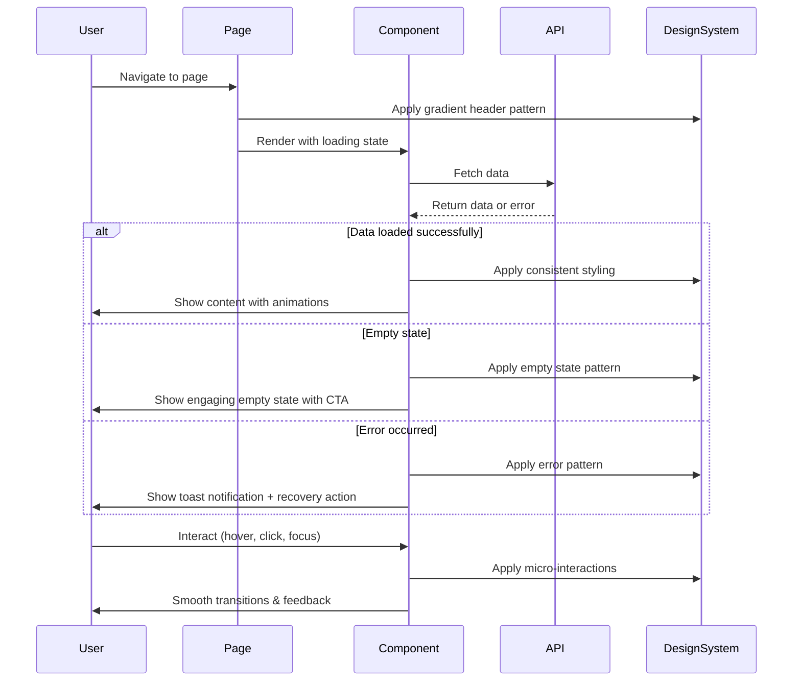
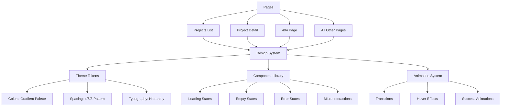

# Design Document: Professional Frontend Polish

## Overview

This design document outlines comprehensive professional polish improvements for the Eligify MVP frontend. The goal is to elevate the user experience from "working MVP" to "polished SaaS product" through visual consistency, enhanced micro-interactions, improved loading/empty states, and refined accessibility. The design maintains the existing purple-pink-orange gradient theme while ensuring consistency across all pages and components.

## Main Algorithm/Workflow



## Architecture



## Core Interfaces/Types

```typescript
// Design System Tokens
interface DesignTokens {
  colors: {
    gradient: {
      primary: string;      // purple-600 → pink-500 → orange-400
      header: string;       // Consistent gradient for all page headers
      button: string;       // Gradient for primary CTAs
      skeleton: string;     // Gradient for loading states
    };
    border: {
      card: string[];       // purple-100, blue-100, green-100, pink-100
      focus: string;        // Focus ring color
    };
  };
  spacing: {
    gap: number[];          // [4, 6, 8] - Consistent gap pattern
    padding: number[];      // [4, 6, 8] - Consistent padding
  };
  animation: {
    duration: {
      fast: string;         // 150ms
      normal: string;       // 200ms
      slow: string;         // 300ms
    };
    easing: string;         // ease-out
  };
}

// Loading State Component
interface LoadingStateProps {
  variant: 'skeleton' | 'spinner' | 'gradient';
  size?: 'sm' | 'md' | 'lg';
  className?: string;
}

// Empty State Component
interface EmptyStateProps {
  icon: React.ComponentType;
  title: string;
  description: string;
  action?: {
    label: string;
    onClick: () => void;
    icon?: React.ComponentType;
  };
  variant?: 'default' | 'gradient';
}

// Error State Component
interface ErrorStateProps {
  message: string;
  recovery?: {
    label: string;
    onClick: () => void;
  };
  variant: 'toast' | 'inline' | 'page';
}

// Micro-interaction Hook
interface UseMicroInteraction {
  isHovered: boolean;
  isFocused: boolean;
  isPressed: boolean;
  handlers: {
    onMouseEnter: () => void;
    onMouseLeave: () => void;
    onFocus: () => void;
    onBlur: () => void;
    onMouseDown: () => void;
    onMouseUp: () => void;
  };
}
```


## Key Functions with Formal Specifications

### Function 1: applyGradientHeader()

```typescript
function applyGradientHeader(pageTitle: string, subtitle?: string): JSX.Element
```

**Preconditions:**
- `pageTitle` is non-empty string
- `subtitle` is optional string or undefined

**Postconditions:**
- Returns valid JSX element with gradient background
- Gradient uses consistent purple-pink-orange theme
- Text is white with proper contrast ratio (WCAG AA compliant)
- Padding and spacing follow 4/6/8 pattern

**Loop Invariants:** N/A

### Function 2: renderLoadingState()

```typescript
function renderLoadingState(variant: LoadingVariant, count?: number): JSX.Element
```

**Preconditions:**
- `variant` is one of: 'skeleton', 'spinner', 'gradient'
- `count` is positive integer or undefined (defaults to 1)

**Postconditions:**
- Returns loading UI matching the specified variant
- Skeleton loaders use gradient animation
- Spinner uses brand colors
- Loading state is accessible (aria-busy="true")

**Loop Invariants:**
- For skeleton arrays: All rendered skeletons maintain consistent dimensions

### Function 3: renderEmptyState()

```typescript
function renderEmptyState(config: EmptyStateConfig): JSX.Element
```

**Preconditions:**
- `config.icon` is valid React component
- `config.title` is non-empty string
- `config.description` is non-empty string
- `config.action` is optional but if provided, must have label and onClick

**Postconditions:**
- Returns engaging empty state UI
- Icon is centered and properly sized
- CTA button uses gradient styling
- Layout is responsive and accessible

**Loop Invariants:** N/A

### Function 4: showErrorNotification()

```typescript
function showErrorNotification(error: Error, recovery?: RecoveryAction): void
```

**Preconditions:**
- `error` is Error object with message property
- `recovery` is optional object with label and action function

**Postconditions:**
- Toast notification appears with error message
- User-friendly message is displayed (not raw error)
- Recovery action button is shown if provided
- Notification auto-dismisses after 5 seconds
- No side effects on application state

**Loop Invariants:** N/A

### Function 5: applyMicroInteraction()

```typescript
function applyMicroInteraction(element: HTMLElement, config: InteractionConfig): void
```

**Preconditions:**
- `element` is valid DOM element
- `config` specifies hover, focus, or press interactions

**Postconditions:**
- Smooth transitions applied (200ms ease-out)
- Hover effects include scale or shadow changes
- Focus states include visible ring (accessibility)
- Press states include scale-down effect
- All transitions are GPU-accelerated (transform, opacity)

**Loop Invariants:** N/A

## Algorithmic Pseudocode

### Main Page Rendering Algorithm

```pascal
ALGORITHM renderPageWithPolish(pageConfig)
INPUT: pageConfig of type PageConfiguration
OUTPUT: renderedPage of type JSX.Element

BEGIN
  ASSERT pageConfig.title IS NOT NULL
  
  // Step 1: Initialize page state
  state ← initializePageState(pageConfig)
  
  // Step 2: Apply gradient header pattern
  header ← createGradientHeader(pageConfig.title, pageConfig.subtitle)
  
  // Step 3: Handle loading state
  IF state.isLoading THEN
    loadingUI ← renderLoadingState('gradient', pageConfig.skeletonCount)
    RETURN wrapInLayout(header, loadingUI)
  END IF
  
  // Step 4: Handle empty state
  IF state.data IS EMPTY THEN
    emptyUI ← renderEmptyState(pageConfig.emptyStateConfig)
    RETURN wrapInLayout(header, emptyUI)
  END IF
  
  // Step 5: Handle error state
  IF state.error IS NOT NULL THEN
    showErrorNotification(state.error, pageConfig.recoveryAction)
    errorUI ← renderErrorFallback(state.error)
    RETURN wrapInLayout(header, errorUI)
  END IF
  
  // Step 6: Render content with micro-interactions
  content ← renderContent(state.data)
  applyMicroInteractionsToAll(content)
  
  RETURN wrapInLayout(header, content)
END
```

**Preconditions:**
- pageConfig contains valid title and configuration
- Page state management is initialized
- Design system tokens are loaded

**Postconditions:**
- Page renders with consistent gradient header
- Appropriate state (loading/empty/error/content) is shown
- All interactive elements have micro-interactions
- Page is accessible and responsive

**Loop Invariants:** N/A

### Loading State Rendering Algorithm

```pascal
ALGORITHM renderLoadingState(variant, count)
INPUT: variant of type LoadingVariant, count of type integer
OUTPUT: loadingUI of type JSX.Element

BEGIN
  ASSERT variant IN ['skeleton', 'spinner', 'gradient']
  ASSERT count > 0
  
  IF variant = 'skeleton' THEN
    skeletons ← []
    FOR i FROM 1 TO count DO
      skeleton ← createSkeletonWithGradient()
      skeletons.add(skeleton)
    END FOR
    RETURN wrapInContainer(skeletons)
  END IF
  
  IF variant = 'spinner' THEN
    spinner ← createGradientSpinner()
    RETURN centerInContainer(spinner)
  END IF
  
  IF variant = 'gradient' THEN
    gradientLoader ← createGradientProgressBar()
    RETURN wrapInContainer(gradientLoader)
  END IF
END
```

**Preconditions:**
- variant is valid LoadingVariant enum value
- count is positive integer

**Postconditions:**
- Returns appropriate loading UI for variant
- Loading UI uses brand gradient colors
- Animations are smooth and performant
- Accessible loading indicators (aria-busy, aria-label)

**Loop Invariants:**
- All skeleton elements maintain consistent styling
- Animation timing remains constant across all elements

### Empty State Rendering Algorithm

```pascal
ALGORITHM renderEmptyState(config)
INPUT: config of type EmptyStateConfig
OUTPUT: emptyStateUI of type JSX.Element

BEGIN
  ASSERT config.title IS NOT EMPTY
  ASSERT config.description IS NOT EMPTY
  ASSERT config.icon IS VALID_COMPONENT
  
  // Step 1: Create icon container
  iconContainer ← createCenteredContainer()
  icon ← renderIcon(config.icon, size='large', color='gray-400')
  iconContainer.add(icon)
  
  // Step 2: Create text content
  title ← createHeading(config.title, level=2, style='font-bold text-gray-900')
  description ← createParagraph(config.description, style='text-gray-600')
  
  // Step 3: Create action button if provided
  IF config.action IS NOT NULL THEN
    button ← createGradientButton(
      label=config.action.label,
      onClick=config.action.onClick,
      icon=config.action.icon
    )
  ELSE
    button ← NULL
  END IF
  
  // Step 4: Compose empty state
  emptyState ← composeVerticalLayout([
    iconContainer,
    title,
    description,
    button
  ], spacing=6)
  
  RETURN wrapInCard(emptyState, style='border-dashed')
END
```

**Preconditions:**
- config contains valid title, description, and icon
- If action is provided, it has valid label and onClick handler

**Postconditions:**
- Returns engaging empty state UI
- Layout is centered and visually balanced
- CTA button (if present) uses gradient styling
- All text is readable and accessible

**Loop Invariants:** N/A

### Micro-interaction Application Algorithm

```pascal
ALGORITHM applyMicroInteractions(element, config)
INPUT: element of type HTMLElement, config of type InteractionConfig
OUTPUT: void (side effect: element gets interaction handlers)

BEGIN
  ASSERT element IS VALID_DOM_ELEMENT
  
  // Step 1: Apply hover interactions
  IF config.hover IS ENABLED THEN
    element.addEventListener('mouseenter', () => {
      applyTransition(element, 'transform', 'scale(1.02)', '200ms')
      applyTransition(element, 'box-shadow', 'elevated', '200ms')
    })
    element.addEventListener('mouseleave', () => {
      applyTransition(element, 'transform', 'scale(1)', '200ms')
      applyTransition(element, 'box-shadow', 'normal', '200ms')
    })
  END IF
  
  // Step 2: Apply focus interactions
  IF config.focus IS ENABLED THEN
    element.addEventListener('focus', () => {
      applyFocusRing(element, color='primary', width='2px')
    })
    element.addEventListener('blur', () => {
      removeFocusRing(element)
    })
  END IF
  
  // Step 3: Apply press interactions
  IF config.press IS ENABLED THEN
    element.addEventListener('mousedown', () => {
      applyTransition(element, 'transform', 'scale(0.98)', '150ms')
    })
    element.addEventListener('mouseup', () => {
      applyTransition(element, 'transform', 'scale(1)', '150ms')
    })
  END IF
  
  // Step 4: Ensure GPU acceleration
  element.style.willChange = 'transform, opacity'
END
```

**Preconditions:**
- element is valid DOM element
- config specifies which interactions to enable
- Element is mounted in DOM

**Postconditions:**
- Event listeners attached to element
- Transitions use GPU-accelerated properties
- All animations are smooth (60fps)
- Interactions are accessible (keyboard + mouse)

**Loop Invariants:** N/A


## Example Usage

```typescript
// Example 1: Projects List Page with Gradient Header
function ProjectsListPage() {
  const { projects, isLoading, error } = useProjects();
  
  return (
    <MainLayout>
      <div className="min-h-screen bg-gradient-to-br from-orange-50/30 via-white to-purple-50/20">
        {/* Gradient Header Pattern */}
        <div className="rounded-xl bg-gradient-to-r from-purple-600 via-pink-500 to-orange-400 p-8 text-white shadow-lg">
          <h1 className="text-3xl font-bold">Learning Projects</h1>
          <p className="mt-2 text-purple-100">AI-generated roadmaps to build your skills</p>
        </div>
        
        {/* Loading State */}
        {isLoading && (
          <div className="mt-6 space-y-4">
            {[...Array(3)].map((_, i) => (
              <div key={i} className="skeleton h-48 animate-gradient"></div>
            ))}
          </div>
        )}
        
        {/* Empty State */}
        {!isLoading && projects.length === 0 && (
          <EmptyState
            icon={FolderKanban}
            title="No projects yet"
            description="Generate your first AI-powered learning project"
            action={{
              label: "Generate Project",
              onClick: () => setShowModal(true),
              icon: Sparkles
            }}
          />
        )}
        
        {/* Error State */}
        {error && (
          <ErrorNotification
            message="Failed to load projects"
            recovery={{
              label: "Try Again",
              onClick: () => refetch()
            }}
          />
        )}
        
        {/* Content with Micro-interactions */}
        {!isLoading && projects.length > 0 && (
          <div className="mt-6 space-y-4">
            {projects.map(project => (
              <ProjectCard 
                key={project.id} 
                project={project}
                className="card-hover transition-all duration-200"
              />
            ))}
          </div>
        )}
      </div>
    </MainLayout>
  );
}

// Example 2: Enhanced 404 Page
function NotFoundPage() {
  return (
    <div className="flex min-h-screen items-center justify-center bg-gradient-to-br from-orange-50/30 via-white to-purple-50/20">
      <div className="text-center">
        {/* Animated 404 with Gradient */}
        <h1 className="text-9xl font-bold bg-gradient-to-r from-purple-600 via-pink-500 to-orange-400 bg-clip-text text-transparent animate-pulse">
          404
        </h1>
        
        {/* Engaging Illustration */}
        <div className="mt-8 mx-auto h-64 w-64">
          <Lottie animationData={notFoundAnimation} />
        </div>
        
        <h2 className="mt-6 text-3xl font-bold text-gray-900">
          Page Not Found
        </h2>
        <p className="mt-2 text-gray-600">
          Looks like you've ventured into uncharted territory
        </p>
        
        {/* Helpful Navigation */}
        <div className="mt-8 flex gap-4 justify-center">
          <Link href="/dashboard" className="btn-primary flex items-center gap-2">
            <Home className="h-4 w-4" />
            Go to Dashboard
          </Link>
          <Link href="/internships" className="btn-secondary flex items-center gap-2">
            <Briefcase className="h-4 w-4" />
            Browse Internships
          </Link>
        </div>
      </div>
    </div>
  );
}

// Example 3: Gradient Skeleton Loader Component
function GradientSkeleton({ className }: { className?: string }) {
  return (
    <div className={cn(
      "animate-pulse rounded-lg bg-gradient-to-r from-gray-200 via-gray-100 to-gray-200",
      "bg-[length:200%_100%] animate-shimmer",
      className
    )} />
  );
}

// Example 4: Micro-interaction Hook Usage
function InteractiveCard({ children }: { children: React.ReactNode }) {
  const { isHovered, handlers } = useMicroInteraction();
  
  return (
    <div
      {...handlers}
      className={cn(
        "card transition-all duration-200",
        isHovered && "scale-102 shadow-xl -translate-y-1"
      )}
    >
      {children}
    </div>
  );
}

// Example 5: Toast Notification System
function useErrorHandling() {
  const handleError = (error: Error, recovery?: () => void) => {
    notify.error(
      <div className="flex items-start gap-3">
        <AlertCircle className="h-5 w-5 text-red-500 flex-shrink-0" />
        <div className="flex-1">
          <p className="font-medium text-gray-900">Something went wrong</p>
          <p className="text-sm text-gray-600">{error.message}</p>
          {recovery && (
            <button
              onClick={recovery}
              className="mt-2 text-sm font-medium text-primary hover:underline"
            >
              Try again
            </button>
          )}
        </div>
      </div>
    );
  };
  
  return { handleError };
}
```

## Components and Interfaces

### Component 1: GradientHeader

**Purpose**: Provide consistent gradient header pattern across all pages

**Interface**:
```typescript
interface GradientHeaderProps {
  title: string;
  subtitle?: string;
  actions?: React.ReactNode;
  stats?: Array<{
    label: string;
    value: string | number;
    icon?: React.ComponentType;
  }>;
}
```

**Responsibilities**:
- Render gradient background (purple → pink → orange)
- Display title and optional subtitle with proper typography
- Support optional action buttons (e.g., "Generate Project")
- Support optional stats display (e.g., live counts)
- Ensure text contrast meets WCAG AA standards

### Component 2: LoadingState

**Purpose**: Provide branded loading indicators for all async operations

**Interface**:
```typescript
interface LoadingStateProps {
  variant: 'skeleton' | 'spinner' | 'gradient' | 'page';
  count?: number;
  size?: 'sm' | 'md' | 'lg';
  message?: string;
}
```

**Responsibilities**:
- Render appropriate loading UI based on variant
- Use gradient animations for skeleton loaders
- Show spinner with brand colors
- Support different sizes for different contexts
- Include accessible loading indicators (aria-busy, aria-label)

### Component 3: EmptyState

**Purpose**: Provide engaging empty states that encourage user action

**Interface**:
```typescript
interface EmptyStateProps {
  icon: React.ComponentType<{ className?: string }>;
  title: string;
  description: string;
  action?: {
    label: string;
    onClick: () => void;
    icon?: React.ComponentType;
  };
  illustration?: React.ReactNode;
  variant?: 'default' | 'gradient';
}
```

**Responsibilities**:
- Display large, centered icon or illustration
- Show clear, encouraging title and description
- Provide prominent CTA button with gradient styling
- Support optional custom illustrations
- Maintain visual hierarchy and spacing

### Component 4: ErrorBoundary (Enhanced)

**Purpose**: Catch and display errors gracefully with recovery options

**Interface**:
```typescript
interface ErrorBoundaryProps {
  children: React.ReactNode;
  fallback?: React.ComponentType<{ error: Error; reset: () => void }>;
  onError?: (error: Error, errorInfo: React.ErrorInfo) => void;
}
```

**Responsibilities**:
- Catch React errors in component tree
- Display user-friendly error message
- Provide "Try Again" recovery action
- Log errors for debugging
- Prevent entire app crash

### Component 5: MicroInteractionWrapper

**Purpose**: Apply consistent micro-interactions to interactive elements

**Interface**:
```typescript
interface MicroInteractionWrapperProps {
  children: React.ReactNode;
  hover?: boolean;
  focus?: boolean;
  press?: boolean;
  scale?: number;
  className?: string;
}
```

**Responsibilities**:
- Apply hover effects (scale, shadow)
- Apply focus states (ring, outline)
- Apply press effects (scale down)
- Use GPU-accelerated transforms
- Ensure smooth 60fps animations

## Data Models

### Model 1: DesignTokens

```typescript
interface DesignTokens {
  colors: {
    gradient: {
      primary: string;
      header: string;
      button: string;
      skeleton: string;
    };
    border: {
      card: string[];
      focus: string;
    };
    text: {
      primary: string;
      secondary: string;
      muted: string;
    };
  };
  spacing: {
    gap: [4, 6, 8];
    padding: [4, 6, 8];
    margin: [4, 6, 8];
  };
  animation: {
    duration: {
      fast: '150ms';
      normal: '200ms';
      slow: '300ms';
    };
    easing: 'ease-out';
  };
  typography: {
    heading: {
      h1: string;
      h2: string;
      h3: string;
    };
    body: {
      large: string;
      normal: string;
      small: string;
    };
  };
}
```

**Validation Rules**:
- All color values must be valid CSS colors
- Spacing values must be multiples of 4
- Animation durations must be in milliseconds
- Typography values must be valid Tailwind classes

### Model 2: PageConfiguration

```typescript
interface PageConfiguration {
  title: string;
  subtitle?: string;
  hasGradientHeader: boolean;
  skeletonCount?: number;
  emptyStateConfig?: EmptyStateConfig;
  errorRecoveryAction?: () => void;
  microInteractions: {
    cards: boolean;
    buttons: boolean;
    inputs: boolean;
  };
}
```

**Validation Rules**:
- title must be non-empty string
- skeletonCount must be positive integer if provided
- emptyStateConfig must have valid icon, title, description
- microInteractions must specify at least one enabled interaction


## Error Handling

### Error Scenario 1: API Request Failure

**Condition**: API call fails due to network error, timeout, or server error
**Response**: 
- Show toast notification with user-friendly error message
- Display inline error state if appropriate for the context
- Preserve user's input/state where possible
**Recovery**: 
- Provide "Try Again" button to retry the request
- Offer alternative navigation if retry fails multiple times
- Log error details for debugging

### Error Scenario 2: Component Render Error

**Condition**: React component throws error during render
**Response**:
- ErrorBoundary catches the error
- Display fallback UI with error message
- Prevent entire app crash
**Recovery**:
- Provide "Reload Page" button
- Show navigation links to other pages
- Log error with stack trace

### Error Scenario 3: Empty Data State

**Condition**: API returns successfully but with empty array/object
**Response**:
- Display engaging empty state component
- Show helpful message explaining why it's empty
- Provide clear CTA to populate data
**Recovery**:
- CTA button navigates to creation flow
- Show examples or suggestions
- Offer help documentation link

### Error Scenario 4: Loading Timeout

**Condition**: API request takes longer than expected (>10 seconds)
**Response**:
- Show extended loading message
- Display "This is taking longer than usual" notice
- Provide option to cancel and retry
**Recovery**:
- "Cancel" button aborts request
- "Keep Waiting" button extends timeout
- "Go Back" button navigates away

### Error Scenario 5: Validation Error

**Condition**: User input fails validation (form submission)
**Response**:
- Highlight invalid fields with red border
- Show inline error messages below fields
- Prevent form submission
**Recovery**:
- Clear, actionable error messages
- Auto-focus first invalid field
- Show validation rules/examples

## Testing Strategy

### Unit Testing Approach

**Component Testing**:
- Test each design system component in isolation
- Verify props are correctly applied
- Test all variants (loading, empty, error states)
- Ensure accessibility attributes are present
- Test keyboard navigation and focus management

**Hook Testing**:
- Test useMicroInteraction hook with different configs
- Verify event handlers are correctly attached
- Test state transitions (hover, focus, press)
- Ensure cleanup on unmount

**Utility Testing**:
- Test design token functions
- Verify gradient generation
- Test spacing calculations
- Ensure color contrast calculations

**Coverage Goals**: 80% code coverage for all new components

### Property-Based Testing Approach

**Property Test Library**: fast-check (for TypeScript/React)

**Properties to Test**:

1. **Gradient Header Consistency**
   - Property: All pages with gradient headers use identical gradient values
   - Generator: Generate random page configurations
   - Assertion: Gradient CSS matches design tokens exactly

2. **Loading State Accessibility**
   - Property: All loading states have aria-busy and aria-label
   - Generator: Generate different loading variants and counts
   - Assertion: Rendered HTML contains required ARIA attributes

3. **Empty State CTA Presence**
   - Property: Empty states always have actionable CTA
   - Generator: Generate random empty state configs
   - Assertion: Rendered component contains button with onClick handler

4. **Micro-interaction Performance**
   - Property: All transitions use GPU-accelerated properties
   - Generator: Generate different interaction configs
   - Assertion: Applied styles only use transform/opacity

5. **Color Contrast Compliance**
   - Property: All text on gradient backgrounds meets WCAG AA
   - Generator: Generate different gradient combinations
   - Assertion: Contrast ratio >= 4.5:1 for normal text

### Integration Testing Approach

**Page-Level Testing**:
- Test complete page rendering with all states
- Verify gradient header appears on all pages
- Test loading → content transition
- Test empty state → content transition
- Test error handling and recovery flows

**User Flow Testing**:
- Test navigation between pages maintains consistency
- Verify micro-interactions work across all interactive elements
- Test toast notifications appear and dismiss correctly
- Verify keyboard navigation works throughout app

**Visual Regression Testing**:
- Use Playwright or Chromatic for visual diffs
- Capture screenshots of all pages in all states
- Compare against baseline to catch unintended changes
- Test responsive breakpoints (mobile, tablet, desktop)

## Performance Considerations

### Animation Performance

**GPU Acceleration**:
- Use only transform and opacity for animations
- Apply will-change: transform, opacity to animated elements
- Remove will-change after animation completes
- Target: 60fps for all animations

**Debouncing and Throttling**:
- Debounce hover effects on rapid mouse movement
- Throttle scroll-based animations
- Use requestAnimationFrame for smooth updates

### Loading Optimization

**Code Splitting**:
- Lazy load heavy components (charts, illustrations)
- Split design system components into separate chunks
- Use dynamic imports for modals and overlays

**Image Optimization**:
- Use Next.js Image component for all images
- Provide appropriate sizes and formats (WebP)
- Lazy load images below the fold
- Use blur placeholders for better perceived performance

### Bundle Size

**Tree Shaking**:
- Import only used Lucide icons
- Use modular imports for utility libraries
- Remove unused CSS with PurgeCSS

**Target Metrics**:
- First Contentful Paint (FCP): < 1.5s
- Largest Contentful Paint (LCP): < 2.5s
- Time to Interactive (TTI): < 3.5s
- Cumulative Layout Shift (CLS): < 0.1

## Security Considerations

### XSS Prevention

**User-Generated Content**:
- Sanitize all user input before rendering
- Use React's built-in XSS protection (JSX escaping)
- Avoid dangerouslySetInnerHTML unless absolutely necessary
- Validate and sanitize URLs before rendering links

### Accessibility Security

**Focus Management**:
- Prevent focus trapping in modals (allow Escape key)
- Ensure focus returns to trigger element on modal close
- Prevent keyboard navigation to hidden elements

**Screen Reader Security**:
- Don't expose sensitive information in aria-labels
- Use aria-live regions carefully to avoid information leakage
- Ensure error messages don't reveal system details

### Content Security Policy

**Inline Styles**:
- Minimize inline styles (use CSS classes)
- Use nonce for required inline styles
- Avoid eval() in animations or dynamic styling

## Dependencies

### Required Libraries

**UI Components**:
- lucide-react: ^0.263.1 (icons)
- clsx: ^2.0.0 (conditional classes)
- tailwind-merge: ^2.0.0 (merge Tailwind classes)

**Animation**:
- framer-motion: ^10.16.4 (complex animations, optional)
- react-spring: ^9.7.3 (spring animations, optional)

**Notifications**:
- react-hot-toast: ^2.4.1 (toast notifications, already in use)

**Testing**:
- @testing-library/react: ^14.0.0
- @testing-library/jest-dom: ^6.1.4
- @testing-library/user-event: ^14.5.1
- fast-check: ^3.13.2 (property-based testing)
- playwright: ^1.40.0 (E2E and visual regression)

**Development**:
- tailwindcss: ^3.3.5 (already in use)
- typescript: ^5.2.2 (already in use)
- eslint-plugin-jsx-a11y: ^6.8.0 (accessibility linting)

### Design Assets

**Illustrations** (optional):
- Lottie animations for empty states and 404 page
- Custom SVG illustrations for empty states
- Icon set consistency (Lucide React)

**Fonts**:
- Inter (already in use via Tailwind)
- Ensure font loading optimization

## Correctness Properties

### Universal Quantification Statements

1. **Gradient Header Consistency**
   - ∀ page ∈ Pages: page.hasGradientHeader ⟹ page.gradient = DESIGN_TOKENS.gradient.header
   - All pages with gradient headers use the exact same gradient values

2. **Loading State Accessibility**
   - ∀ loadingState ∈ LoadingStates: loadingState.hasAttribute('aria-busy') ∧ loadingState.hasAttribute('aria-label')
   - All loading states include required accessibility attributes

3. **Empty State Actionability**
   - ∀ emptyState ∈ EmptyStates: emptyState.hasCTA ∧ emptyState.CTA.hasOnClick
   - All empty states provide actionable CTAs with click handlers

4. **Micro-interaction Performance**
   - ∀ interaction ∈ MicroInteractions: interaction.properties ⊆ {transform, opacity}
   - All micro-interactions use only GPU-accelerated properties

5. **Color Contrast Compliance**
   - ∀ text ∈ TextOnGradient: contrastRatio(text.color, text.background) ≥ 4.5
   - All text on gradient backgrounds meets WCAG AA contrast requirements

6. **Error Recovery Availability**
   - ∀ error ∈ Errors: error.hasRecoveryAction ∨ error.hasNavigationFallback
   - All errors provide either recovery action or navigation fallback

7. **Spacing Consistency**
   - ∀ gap ∈ Gaps: gap.value ∈ {4, 6, 8} × 4px
   - All spacing follows the 4/6/8 pattern (16px, 24px, 32px)

8. **Animation Smoothness**
   - ∀ animation ∈ Animations: animation.fps ≥ 60 ∧ animation.duration ≤ 300ms
   - All animations run at 60fps and complete within 300ms

9. **Focus State Visibility**
   - ∀ interactive ∈ InteractiveElements: interactive.onFocus ⟹ interactive.hasFocusRing
   - All interactive elements show visible focus ring when focused

10. **Responsive Breakpoint Consistency**
    - ∀ component ∈ Components: component.isResponsive ⟹ component.breakpoints = DESIGN_TOKENS.breakpoints
    - All responsive components use consistent breakpoint values

